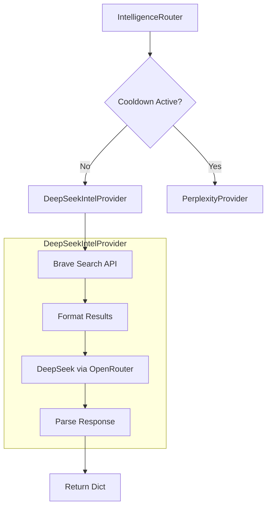
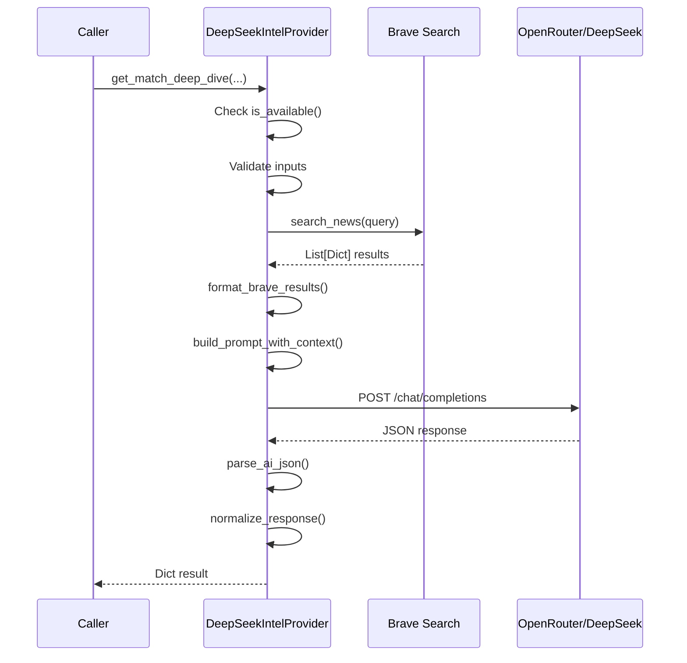

# Design Document: DeepSeek Migration

## Overview

Questo documento descrive il design per la migrazione del sistema di intelligence da Gemini (con Google Search Grounding) a DeepSeek via OpenRouter. Il nuovo `DeepSeekIntelProvider` utilizzerà un approccio a due fasi:

1. **Fase Search**: Brave Search API per ottenere risultati web real-time
2. **Fase Analysis**: DeepSeek via OpenRouter per analizzare i risultati

Questo approccio replica la funzionalità di Google Search Grounding mantenendo la stessa interfaccia di `GeminiAgentProvider`.

## Architecture



### Flow per ogni metodo:



## Components and Interfaces

### DeepSeekIntelProvider

```python
class DeepSeekIntelProvider:
    """
    Provider AI che usa DeepSeek via OpenRouter + Brave Search.
    Drop-in replacement per GeminiAgentProvider.
    """
    
    def __init__(self):
        """Inizializza con OPENROUTER_API_KEY e BraveSearchProvider."""
        
    def is_available(self) -> bool:
        """True se API key configurata e no cooldown attivo."""
        
    # === METODI PUBBLICI (stessa interfaccia di GeminiAgentProvider) ===
    
    def get_match_deep_dive(
        self,
        home_team: str,
        away_team: str,
        match_date: str = None,
        referee: str = None,
        missing_players: list = None
    ) -> Optional[Dict]:
        """Analisi approfondita partita."""
        
    def verify_news_item(
        self,
        news_title: str,
        news_snippet: str,
        team_name: str,
        news_source: str = "Unknown",
        match_context: str = "upcoming match"
    ) -> Optional[Dict]:
        """Verifica singola news."""
        
    def verify_news_batch(
        self,
        news_items: List[Dict],
        team_name: str,
        match_context: str = "upcoming match",
        max_items: int = 5
    ) -> List[Dict]:
        """Verifica batch di news."""
        
    def get_betting_stats(
        self,
        home_team: str,
        away_team: str,
        match_date: str,
        league: str = None
    ) -> Optional[Dict]:
        """Statistiche corner/cards."""
        
    def confirm_biscotto(
        self,
        home_team: str,
        away_team: str,
        match_date: str,
        league: str,
        draw_odds: float,
        implied_prob: float,
        odds_pattern: str,
        season_context: str,
        detected_factors: List[str] = None
    ) -> Optional[Dict]:
        """Conferma segnale biscotto."""
        
    def enrich_match_context(
        self,
        home_team: str,
        away_team: str,
        match_date: str,
        league: str,
        existing_context: str = ""
    ) -> Optional[Dict]:
        """Arricchimento contesto partita."""
        
    def extract_twitter_intel(
        self,
        handles: List[str],
        max_posts_per_account: int = 5
    ) -> Optional[Dict]:
        """Estrazione tweet da account specificati."""
        
    def format_for_prompt(self, deep_dive: Dict) -> str:
        """Formatta risultati per prompt AI."""
        
    def format_enrichment_for_prompt(self, enrichment: Dict) -> str:
        """Formatta arricchimento per prompt AI."""
```

### Metodi Interni

```python
class DeepSeekIntelProvider:
    # === METODI INTERNI ===
    
    def _search_brave(self, query: str, limit: int = 5) -> List[Dict]:
        """
        Esegue ricerca Brave e ritorna risultati.
        Gestisce errori gracefully.
        """
        
    def _format_brave_results(self, results: List[Dict]) -> str:
        """
        Formatta risultati Brave per inclusione nel prompt.
        Include title, URL, snippet per ogni risultato.
        """
        
    def _build_prompt_with_context(
        self,
        base_prompt: str,
        brave_results: str
    ) -> str:
        """
        Costruisce prompt finale con contesto Brave.
        Rimuove riferimenti a Google Search.
        """
        
    def _call_deepseek(
        self,
        prompt: str,
        operation_name: str
    ) -> Optional[str]:
        """
        Chiama DeepSeek via OpenRouter con retry e rate limiting.
        Attiva CooldownManager su 429.
        """
        
    def _wait_for_rate_limit(self):
        """Enforce 2s minimum interval tra richieste."""
```

## Data Models

### Input/Output (identici a GeminiAgentProvider)

```python
# Deep Dive Response
{
    "internal_crisis": "High/Medium/Low - Explanation",
    "turnover_risk": "High/Medium/Low - Explanation",
    "referee_intel": "Strict/Lenient - Avg Cards",
    "biscotto_potential": "Yes/No - Reasoning",
    "injury_impact": "Critical/Manageable - Assessment",
    "btts_impact": "Positive/Negative/Neutral - Impact",
    "motivation_home": "High/Medium/Low - Reason",
    "motivation_away": "High/Medium/Low - Reason",
    "table_context": "Brief league table context"
}

# Betting Stats Response
{
    "home_corners_avg": float,
    "away_corners_avg": float,
    "corners_total_avg": float,
    "corners_signal": "High/Medium/Low",
    "corners_reasoning": str,
    "home_cards_avg": float,
    "away_cards_avg": float,
    "cards_total_avg": float,
    "cards_signal": "Aggressive/Medium/Disciplined",
    "cards_reasoning": str,
    "referee_name": str,
    "referee_cards_avg": float,
    "referee_strictness": "Strict/Medium/Lenient/Unknown",
    "match_intensity": "High/Medium/Low",
    "is_derby": bool,
    "recommended_corner_line": str,
    "recommended_cards_line": str,
    "data_confidence": "High/Medium/Low",
    "sources_found": str
}

# News Verification Response
{
    "verified": bool,
    "verification_status": "CONFIRMED/DENIED/UNVERIFIED/OUTDATED",
    "confidence_level": "HIGH/MEDIUM/LOW",
    "verification_sources": List[str],
    "additional_context": str,
    "betting_impact": "Critical/Significant/Minor/None",
    "is_current": bool,
    "notes": str
}

# Biscotto Confirmation Response
{
    "biscotto_confirmed": bool,
    "confidence_boost": int,  # 0-30
    "home_team_objective": str,
    "away_team_objective": str,
    "mutual_benefit_found": bool,
    "mutual_benefit_reason": str,
    "h2h_pattern": str,
    "club_relationship": str,
    "manager_hints": str,
    "market_sentiment": str,
    "additional_context": str,
    "final_recommendation": str
}

# Match Enrichment Response
{
    "home_form": str,
    "home_form_trend": "Improving/Declining/Stable",
    "away_form": str,
    "away_form_trend": "Improving/Declining/Stable",
    "home_recent_news": str,
    "away_recent_news": str,
    "h2h_recent": str,
    "h2h_goals_pattern": str,
    "match_importance": str,
    "home_motivation": "High/Medium/Low",
    "away_motivation": "High/Medium/Low",
    "weather_forecast": str,
    "weather_impact": str,
    "additional_context": str,
    "data_freshness": "High/Medium/Low"
}

# Twitter Intel Response
{
    "accounts": [
        {
            "handle": "@example",
            "posts": [
                {
                    "date": "YYYY-MM-DD",
                    "content": str,
                    "topics": List[str]
                }
            ]
        }
    ],
    "extraction_time": str  # ISO8601
}
```

### Brave Results Format (interno)

```python
# Risultato singolo da Brave
{
    "title": str,
    "url": str,
    "snippet": str,
    "source": "brave"
}

# Formato per prompt DeepSeek
"""
[WEB SEARCH RESULTS]
1. Title: {title}
   URL: {url}
   Summary: {snippet}

2. Title: {title}
   URL: {url}
   Summary: {snippet}
...
"""
```

## Correctness Properties

*A property is a characteristic or behavior that should hold true across all valid executions of a system-essentially, a formal statement about what the system should do. Properties serve as the bridge between human-readable specifications and machine-verifiable correctness guarantees.*

### Property 1: Disabled Provider Returns None
*For any* method call on a disabled provider (no API key), the method SHALL return None without throwing exceptions.
**Validates: Requirements 1.3**

### Property 2: Availability Reflects State
*For any* combination of API key presence and cooldown state, is_available() SHALL return True only when API key is set AND cooldown is not active.
**Validates: Requirements 1.4**

### Property 3: Interface Compatibility
*For any* method in DeepSeekIntelProvider, the method SHALL accept the same parameters and return the same Dict structure as the corresponding GeminiAgentProvider method.
**Validates: Requirements 2.1-2.8**

### Property 4: Brave Results Formatting
*For any* list of Brave search results, the formatted output SHALL contain title, URL, and snippet for each result.
**Validates: Requirements 3.5**

### Property 5: Cooldown Blocks All Methods
*For any* method call when CooldownManager cooldown is active, the method SHALL return None without making API calls.
**Validates: Requirements 4.4**

### Property 6: Prompts Without Google References
*For any* prompt generated for DeepSeek, the prompt SHALL NOT contain the strings "Google Search" or "search grounding".
**Validates: Requirements 5.1**

### Property 7: Prompts Include Brave Context
*For any* prompt generated when Brave results are available, the prompt SHALL include a section with the formatted Brave results.
**Validates: Requirements 5.2, 5.3**

### Property 8: Invalid Input Returns None
*For any* method call with None or empty required parameters, the method SHALL return None without making API calls.
**Validates: Requirements 7.1**

### Property 9: Invalid JSON Handled Gracefully
*For any* invalid JSON response from DeepSeek, the system SHALL use parse_ai_json fallback and return a valid Dict or None.
**Validates: Requirements 7.2**

### Property 10: Exceptions Return None
*For any* unexpected exception during method execution, the method SHALL catch it and return None.
**Validates: Requirements 7.5**

### Property 11: Singleton Consistency
*For any* number of calls to get_deepseek_provider(), all calls SHALL return the same instance.
**Validates: Requirements 8.1**

## Error Handling

### Errori Brave Search

| Errore | Comportamento |
|--------|---------------|
| 429 Rate Limit | Log warning, procedi senza risultati web |
| Timeout | Log error, procedi senza risultati web |
| Network Error | Log error, procedi senza risultati web |
| Empty Results | Procedi con prompt senza contesto web |

### Errori OpenRouter/DeepSeek

| Errore | Comportamento |
|--------|---------------|
| 429 Rate Limit | Attiva CooldownManager 24h, return None |
| 401 Unauthorized | Log error, return None |
| Timeout | Log error, return None |
| Invalid JSON | Usa parse_ai_json fallback |
| Empty Response | Log warning, return None |

### Validazione Input

```python
# Ogni metodo valida i parametri obbligatori
if not home_team or not away_team:
    logger.debug("Skipped: missing required parameters")
    return None
```

## Testing Strategy

### Property-Based Testing

La libreria scelta è **Hypothesis** (già presente nel progetto).

Ogni property test deve:
1. Essere annotato con il riferimento alla property: `**Feature: deepseek-migration, Property N: description**`
2. Eseguire almeno 100 iterazioni
3. Usare generators appropriati per i tipi di input

### Unit Tests

Unit tests per:
- Inizializzazione provider con/senza API key
- Comportamento con cooldown attivo
- Parsing risposte JSON valide/invalide
- Formattazione risultati Brave
- Edge cases (input vuoti, None, etc.)

### Integration Tests (Manuali)

- Test end-to-end con API reali (Brave + OpenRouter)
- Verifica rate limiting funzionante
- Verifica attivazione CooldownManager su 429

### Test Configuration

```python
# conftest.py additions
@pytest.fixture
def mock_openrouter_api_key(monkeypatch):
    monkeypatch.setenv("OPENROUTER_API_KEY", "test-key")

@pytest.fixture
def mock_brave_provider():
    """Mock BraveSearchProvider per test isolati."""
    ...

@pytest.fixture
def mock_deepseek_response():
    """Mock response da OpenRouter."""
    ...
```
