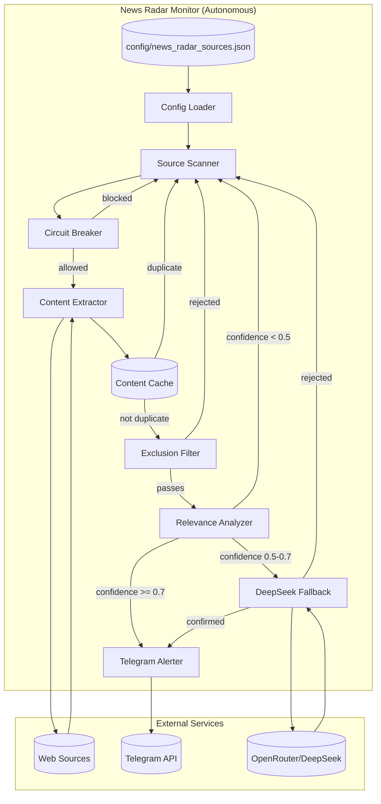

# Design Document: News Radar Monitor

## Overview

News Radar Monitor è un componente di monitoraggio web autonomo che opera 24/7 per scoprire notizie betting-relevant su fonti specifiche configurate manualmente. A differenza del Browser Monitor esistente (che alimenta il pipeline del bot principale), News Radar:

- Opera in completa indipendenza dal bot principale
- Monitora leghe e fonti NON coperte dal sistema esistente
- Invia alert Telegram diretti senza passare per il database
- Ha un flusso dati semplificato: estrazione → filtro → analisi → alert

Il componente eredita le best practices tecniche dal Browser Monitor V7.3 (stealth mode, circuit breaker, hybrid extraction) ma con architettura semplificata e flusso dati lineare.

## Architecture



### Data Flow

1. **Config Loading**: Carica fonti da `config/news_radar_sources.json`
2. **Source Scanning**: Itera sulle fonti in ordine di priorità
3. **Circuit Breaker Check**: Salta fonti con troppi errori consecutivi
4. **Content Extraction**: HTTP + Trafilatura, fallback Playwright
5. **Deduplication**: Hash-based cache (24h TTL)
6. **Exclusion Filter**: Rifiuta basket, femminile, giovanili, NFL, ecc.
7. **Relevance Analysis**: Identifica infortuni, squalifiche, convocazioni
8. **DeepSeek Fallback**: Per news ambigue (confidence 0.5-0.7)
9. **Telegram Alert**: Notifica formattata con tutti i dettagli

## Components and Interfaces

### NewsRadarMonitor (Main Class)

```python
class NewsRadarMonitor:
    """
    Autonomous news monitoring component.
    Runs independently from main bot, sends direct Telegram alerts.
    """
    
    def __init__(self, config_file: str = "config/news_radar_sources.json"):
        """Initialize with config file path."""
        
    async def start(self) -> bool:
        """Start the monitor. Returns True if started successfully."""
        
    async def stop(self) -> bool:
        """Stop the monitor gracefully."""
        
    def is_running(self) -> bool:
        """Check if monitor is running."""
        
    async def scan_cycle(self) -> int:
        """Execute one scan cycle. Returns number of alerts sent."""
        
    async def scan_source(self, source: RadarSource) -> Optional[RadarAlert]:
        """Scan a single source. Returns alert if relevant news found."""
```

### RadarSource (Data Model)

```python
@dataclass
class RadarSource:
    """Configuration for a monitored source."""
    url: str
    name: str
    priority: int = 1
    scan_interval_minutes: int = 5
    navigation_mode: str = "single"  # "single" or "paginated"
    link_selector: Optional[str] = None  # CSS selector for paginated mode
    last_scanned: Optional[datetime] = None
```

### RadarAlert (Data Model)

```python
@dataclass
class RadarAlert:
    """Alert to be sent to Telegram."""
    source_name: str
    source_url: str
    affected_team: str
    category: str  # INJURY, SUSPENSION, NATIONAL_TEAM, CUP_ABSENCE, OTHER
    summary: str
    confidence: float
    discovered_at: datetime
```

### ContentExtractor (Interface)

```python
class ContentExtractor:
    """Extracts clean text from web pages."""
    
    async def extract(self, url: str) -> Optional[str]:
        """Extract text content from URL. Returns None on failure."""
        
    async def extract_with_navigation(
        self, 
        url: str, 
        link_selector: str
    ) -> List[Tuple[str, str]]:
        """Extract from paginated source. Returns list of (url, content)."""
```

### ExclusionFilter (Interface)

```python
class ExclusionFilter:
    """Filters out irrelevant content."""
    
    # Exclusion keywords (multilingual)
    EXCLUDED_SPORTS = [
        "basket", "basketball", "nba", "euroleague", "pallacanestro",
        "baloncesto", "koszykówka", "basketbol"
    ]
    EXCLUDED_CATEGORIES = [
        "women", "woman", "ladies", "feminine", "femminile", "femenino",
        "kobiet", "kadın", "bayan", "wsl", "liga f"
    ]
    EXCLUDED_YOUTH = [
        "primavera", "u19", "u21", "u17", "youth", "academy", "giovanili",
        "juvenil", "cantera", "młodzież"
    ]
    EXCLUDED_OTHER_SPORTS = [
        "nfl", "american football", "rugby", "handball", "volleyball",
        "futsal", "pallavolo", "balonmano"
    ]
    
    def is_excluded(self, content: str) -> bool:
        """Returns True if content should be excluded."""
```

### RelevanceAnalyzer (Interface)

```python
class RelevanceAnalyzer:
    """Analyzes content for betting relevance."""
    
    # Relevance keywords (multilingual)
    INJURY_KEYWORDS = [
        "injury", "injured", "infortunio", "lesión", "lesão", "kontuzja",
        "sakatlık", "out", "ruled out", "miss", "absent", "assente"
    ]
    SUSPENSION_KEYWORDS = [
        "suspended", "suspension", "squalificato", "sancionado",
        "zawieszony", "cezalı", "ban", "banned"
    ]
    NATIONAL_TEAM_KEYWORDS = [
        "national team", "nazionale", "selección", "seleção",
        "reprezentacja", "milli takım", "call-up", "convocato"
    ]
    
    def analyze(self, content: str) -> AnalysisResult:
        """
        Analyze content for relevance.
        Returns: AnalysisResult with is_relevant, category, team, confidence, summary
        """
```

### DeepSeekFallback (Interface)

```python
class DeepSeekFallback:
    """DeepSeek API for ambiguous content analysis."""
    
    def __init__(self, api_key: str, min_interval: float = 2.0):
        """Initialize with API key and rate limit interval."""
        
    async def analyze(self, content: str) -> Optional[AnalysisResult]:
        """
        Deep analysis for ambiguous content.
        Returns None if API unavailable.
        """
```

### TelegramAlerter (Interface)

```python
class TelegramAlerter:
    """Sends alerts to Telegram."""
    
    def __init__(self, token: str, chat_id: str):
        """Initialize with Telegram credentials."""
        
    async def send_alert(self, alert: RadarAlert) -> bool:
        """
        Send formatted alert to Telegram.
        Returns True if sent successfully.
        """
```

## Data Models

### Configuration Schema (news_radar_sources.json)

```json
{
  "sources": [
    {
      "url": "https://example.com/football",
      "name": "Example Football",
      "priority": 1,
      "scan_interval_minutes": 5,
      "navigation_mode": "single"
    },
    {
      "url": "https://betzona.ru/en/bets-sport/prognozi-na-football",
      "name": "Betzona Predictions",
      "priority": 2,
      "scan_interval_minutes": 10,
      "navigation_mode": "paginated",
      "link_selector": "a.match-link"
    }
  ],
  "global_settings": {
    "default_scan_interval_minutes": 5,
    "page_timeout_seconds": 30,
    "cache_ttl_hours": 24,
    "deepseek_confidence_threshold": 0.5,
    "alert_confidence_threshold": 0.7
  }
}
```

### AnalysisResult (Internal)

```python
@dataclass
class AnalysisResult:
    is_relevant: bool
    category: str  # INJURY, SUSPENSION, NATIONAL_TEAM, CUP_ABSENCE, OTHER
    affected_team: Optional[str]
    confidence: float  # 0.0 - 1.0
    summary: str
```

### ContentCache Entry

```python
@dataclass
class CacheEntry:
    content_hash: str  # SHA256 of first 1000 chars
    cached_at: datetime
    source_url: str
```

## Correctness Properties

*A property is a characteristic or behavior that should hold true across all valid executions of a system-essentially, a formal statement about what the system should do. Properties serve as the bridge between human-readable specifications and machine-verifiable correctness guarantees.*

### Property 1: Config Loading Correctness
*For any* valid configuration file with N source entries, loading the configuration SHALL produce exactly N RadarSource objects with matching URLs and settings.
**Validates: Requirements 1.1, 8.1**

### Property 2: Circuit Breaker Activation
*For any* source URL that experiences N consecutive extraction failures where N >= failure_threshold, the circuit breaker SHALL transition to OPEN state and skip that source until recovery_timeout expires.
**Validates: Requirements 1.4**

### Property 3: Exclusion Filter Completeness
*For any* content string containing at least one keyword from EXCLUDED_SPORTS, EXCLUDED_CATEGORIES, EXCLUDED_YOUTH, or EXCLUDED_OTHER_SPORTS, the ExclusionFilter.is_excluded() method SHALL return True.
**Validates: Requirements 3.1, 3.2, 3.3, 3.4**

### Property 4: Relevance Detection Accuracy
*For any* content string containing relevance keywords (injury, suspension, national team, cup absence) and NOT containing exclusion keywords, the RelevanceAnalyzer SHALL return is_relevant=True with the appropriate category.
**Validates: Requirements 4.1, 4.2, 4.3, 4.4**

### Property 5: Confidence Threshold Routing
*For any* AnalysisResult with confidence C:
- If C >= 0.7: alert is sent directly
- If 0.5 <= C < 0.7: DeepSeek fallback is invoked
- If C < 0.5: content is skipped
**Validates: Requirements 4.5, 5.1**

### Property 6: DeepSeek Rate Limiting
*For any* sequence of N DeepSeek API calls, the time elapsed between call i and call i+1 SHALL be >= 2.0 seconds.
**Validates: Requirements 5.4**

### Property 7: Content Deduplication Round-Trip
*For any* content string S:
1. First processing: cache.is_cached(S) returns False, then cache.add(S) stores the hash
2. Second processing within 24h: cache.is_cached(S) returns True
3. Processing after 24h expiry: cache.is_cached(S) returns False
**Validates: Requirements 7.1, 7.2, 7.3, 7.4**

### Property 8: Alert Content Completeness
*For any* RadarAlert sent to Telegram, the message string SHALL contain: source_name, affected_team, category, summary, and source_url.
**Validates: Requirements 6.1, 6.2**

### Property 9: Priority-Based Scan Ordering
*For any* set of N sources with distinct priorities, the scan order SHALL process sources in descending priority order (highest priority first).
**Validates: Requirements 8.4**

### Property 10: Graceful Error Continuation
*For any* source that raises an exception during extraction, the scan loop SHALL continue processing remaining sources without terminating.
**Validates: Requirements 2.4, 10.2**

## Error Handling

### Extraction Errors
- **HTTP Timeout**: Log warning, fallback to Playwright
- **Playwright Timeout**: Log warning, record circuit breaker failure
- **Empty Content**: Log debug, skip source (not a circuit breaker failure)
- **Network Error**: Log error, record circuit breaker failure, retry with backoff

### API Errors
- **DeepSeek 429 (Rate Limit)**: Wait and retry once, then skip
- **DeepSeek Timeout**: Log warning, skip ambiguous content
- **DeepSeek Unavailable**: Log error, skip ambiguous content
- **Telegram 429**: Exponential backoff (2s, 4s, 8s), max 3 retries
- **Telegram Error**: Log error, continue to next alert

### Configuration Errors
- **Missing Config File**: Log error, exit with clear message
- **Invalid JSON**: Log error, exit with clear message
- **Missing Required Field**: Log warning, skip invalid source
- **Invalid URL**: Log warning, skip invalid source

## Testing Strategy

### Dual Testing Approach

News Radar Monitor uses both unit tests and property-based tests for comprehensive coverage:

- **Unit Tests**: Verify specific examples, edge cases, and integration points
- **Property-Based Tests**: Verify universal properties hold across all valid inputs

### Property-Based Testing Framework

**Framework**: `hypothesis` (Python)
**Minimum Iterations**: 100 per property test

### Test Categories

#### 1. Exclusion Filter Tests
- Property test: All exclusion keywords trigger rejection
- Unit test: Edge cases (mixed case, partial matches, unicode)

#### 2. Relevance Analyzer Tests
- Property test: Relevance keywords trigger detection with correct category
- Unit test: Multilingual keyword detection

#### 3. Content Cache Tests
- Property test: Round-trip deduplication (add → check → expire → check)
- Unit test: Hash collision handling, TTL boundary

#### 4. Circuit Breaker Tests
- Property test: State transitions (CLOSED → OPEN → HALF_OPEN → CLOSED)
- Unit test: Recovery timeout, failure threshold

#### 5. Config Loading Tests
- Property test: Valid configs produce correct source count
- Unit test: Invalid configs, missing fields, hot reload

#### 6. Alert Formatting Tests
- Property test: All required fields present in message
- Unit test: Special characters, long content truncation

### Test Annotations

Each property-based test MUST include:
```python
# **Feature: news-radar-monitor, Property {N}: {property_text}**
# **Validates: Requirements X.Y**
```
