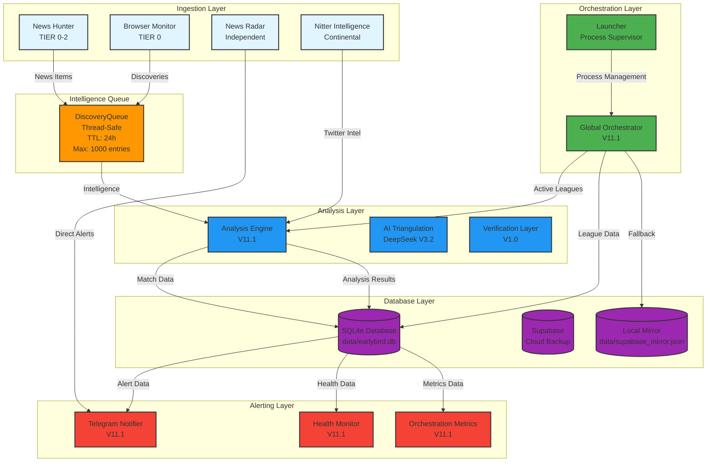

# EarlyBird Data Flow Diagram (V11.1)

**Last Updated:** 2026-02-23  
**Author:** Lead Architect  
**Purpose:** Visual representation of data flow through the EarlyBird system for debugging and understanding.

---

## Overview

The EarlyBird system implements a **Global Parallel Architecture** that processes football betting intelligence through multiple layers:

1. **Ingestion Layer** - External data sources
2. **Orchestration Layer** - System coordination and scheduling
3. **Intelligence Queue** - Thread-safe communication buffer
4. **Analysis Layer** - AI-powered match analysis
5. **Database Layer** - Persistent storage
6. **Alerting Layer** - Telegram notifications

---

## Mermaid Diagram



---

## Detailed Data Flow

### 1. Ingestion Layer

#### News Hunter (TIER 0-2)
- **Purpose:** Searches for betting-relevant news from multiple sources
- **Sources:** Brave, Tavily, MediaStack, Perplexity
- **Output:** News items pushed to DiscoveryQueue
- **Frequency:** On-demand (triggered by match analysis)
- **Data Types:** News articles, injury reports, lineup changes

#### Browser Monitor (TIER 0)
- **Purpose:** Monitors configured web sources 24/7
- **Sources:** Beat writers, news aggregators
- **Output:** Discoveries pushed to DiscoveryQueue
- **Frequency:** Continuous (5-minute intervals)
- **Data Types:** News snippets, URLs, source metadata

#### News Radar (Independent)
- **Purpose:** Monitors minor leagues not covered by main bot
- **Sources:** Configured in `config/news_radar_sources.json`
- **Output:** Direct Telegram alerts (bypasses database)
- **Frequency:** Continuous (5-minute intervals)
- **Data Types:** News articles, filtered by relevance

#### Nitter Intelligence (Continental)
- **Purpose:** Monitors Twitter for breaking news
- **Sources:** Configured in `config/twitter_intel_accounts.py`
- **Output:** Twitter intel fed to Analysis Engine
- **Frequency:** Continuous (Nitter cycle)
- **Data Types:** Tweets, retweets, user mentions

### 2. Orchestration Layer

#### Global Orchestrator (V11.1)
- **Purpose:** Coordinates all active leagues globally
- **Input:** Supabase (primary), Local Mirror (fallback)
- **Output:** Active leagues list to Main Pipeline
- **Frequency:** On-demand (called by Main Pipeline)
- **Fallback:** Supabase → Local Mirror on failure
- **Data Types:** League keys, API keys, continental blocks

#### Launcher (Process Supervisor)
- **Purpose:** Manages all system processes
- **Processes:** Main Pipeline, Telegram Bot, Telegram Monitor, News Radar
- **Output:** Process management (start, restart, stop)
- **Frequency:** Continuous (monitors processes)
- **Features:** Auto-restart, graceful shutdown, pre-flight validation
- **Orchestration Metrics:** Starts metrics collection on startup, stops on shutdown

### 3. Intelligence Queue

#### DiscoveryQueue
- **Purpose:** Thread-safe communication buffer
- **Producers:** News Hunter, Browser Monitor
- **Consumers:** Main Pipeline, Analysis Engine
- **Capacity:** 1000 entries maximum
- **TTL:** 24 hours (auto-expiration)
- **Thread Safety:** RLock for concurrent operations
- **Data Types:** Discovery items (UUID, league, team, title, snippet, URL, source, category, confidence)

### 4. Analysis Layer

#### Analysis Engine (V11.1)
- **Purpose:** Orchestrates match-level analysis
- **Input:** Match data, DiscoveryQueue items, Database data
- **Output:** Analysis results, alert decisions
- **Frequency:** On-demand (triggered by Main Pipeline)
- **Components:**
  - Tactical Analysis (Tactical Veto V5.0)
  - Fatigue Engine (V2.0)
  - Injury Impact Engine (V1.0)
  - Market Intelligence (V2.0)
  - AI Triangulation (DeepSeek V3.2)
  - Verification Layer (V1.0)

#### AI Triangulation (DeepSeek V3.2)
- **Purpose:** Correlates multiple data sources
- **Input:** News, Market Data, Team Stats, Tactical Context, Twitter Intel
- **Output:** Betting insights with confidence scores
- **Models:** Model A (Standard), Model B (Reasoner)
- **Fallback:** Model A if Model B fails

#### Verification Layer (V1.0)
- **Purpose:** Verifies alerts before sending
- **Input:** Preliminary alerts, verification requests
- **Output:** Final alert decisions
- **Sources:** Tavily (primary), Perplexity (fallback)
- **Confidence Thresholds:** HIGH (≥8.0), MEDIUM (≥6.0), LOW (<6.0)

### 5. Database Layer

#### SQLite Database
- **Purpose:** Primary persistent storage
- **Location:** `data/earlybird.db`
- **Tables:**
  - `matches` - Match fixtures and odds
  - `news_log` - Analysis results and alerts
  - `social_sources` - Twitter/intel sources
  - `telegram_channels` - Telegram channel metrics
  - `orchestration_metrics` - System metrics (NEW)
- **Connection Pool:** SQLAlchemy SessionLocal
- **Thread Safety:** Thread-safe operations with locks

#### Supabase (Cloud Backup)
- **Purpose:** Cloud database for multi-instance synchronization
- **Location:** Remote (Supabase)
- **Tables:** leagues, countries, continents, social_sources
- **Usage:** Primary source for league data
- **Fallback:** Local Mirror on failure

#### Local Mirror
- **Purpose:** Fallback for Supabase failures
- **Location:** `data/supabase_mirror.json`
- **Content:** Cached league and social source data
- **Refresh:** Updated periodically by Global Orchestrator
- **Usage:** Fallback when Supabase is unavailable

### 6. Alerting Layer

#### Telegram Notifier (V11.1)
- **Purpose:** Sends betting alerts to Telegram
- **Input:** Alert data, verification results
- **Output:** Telegram messages (HTML formatted)
- **Features:** Retry logic (tenacity), Unicode normalization, safe UTF-8 truncation
- **Channels:** Primary channel, optional secondary channels
- **Rate Limiting:** Respects Telegram API limits

#### Health Monitor (V11.1)
- **Purpose:** Monitors system health
- **Input:** System metrics, database status
- **Output:** Health reports, alerts on failures
- **Frequency:** Every 6 hours
- **Checks:** Disk space, database connectivity, API availability
- **Spam Protection:** 6-hour cooldown per issue type

#### Orchestration Metrics (V11.1) ✅ INTEGRATED
- **Purpose:** Collects orchestration-specific metrics
- **Input:** System metrics, orchestration status, business metrics
- **Output:** Metrics stored in database
- **Integration:** Started by Launcher on startup, runs as background thread
- **Frequency:**
  - System metrics: Every 5 minutes
  - Orchestration metrics: Every 1 minute
  - Business metrics: Every 10 minutes
- **Metrics:**
  - Active leagues count
  - Matches in analysis count
  - Alerts sent per hour/24h
  - Process restart count
  - Process uptime
  - System metrics (CPU, memory, disk, network)

---

## Parallel and Independent Flows

### Parallel Flows
The system supports parallel processing:

1. **4-Tab Radar:** News Radar runs 4 parallel tabs (LATAM, ASIA, AFRICA, GLOBAL)
2. **Continental Intelligence:** Nitter cycle runs for all continents in parallel
3. **Multi-Source Ingestion:** Multiple sources can ingest data simultaneously

### Independent Flows
Some components operate independently:

1. **News Radar:** Operates independently, sends direct Telegram alerts
2. **Health Monitor:** Runs independently, monitors system health
3. **Orchestration Metrics:** Runs independently, collects metrics

---

## Fallback and Retry Logic

### Supabase Fallback
```
Global Orchestrator
    ↓ Try Supabase
    ↓ Success → Use Supabase data
    ↓ Failure → Fallback to Local Mirror
```

### API Retry Logic
```
API Call (Brave, Tavily, MediaStack, Perplexity)
    ↓ Try Primary
    ↓ Success → Return data
    ↓ Failure → Retry (exponential backoff)
    ↓ Max Retries → Try Fallback Provider
```

### Telegram Retry Logic
```
Telegram Notifier
    ↓ Try Send
    ↓ Success → Return
    ↓ Failure → Retry (exponential backoff, max 3 attempts)
    ↓ Max Retries → Log Error
```

---

## Data Types and Formats

### News Items
```json
{
  "uuid": "unique-id",
  "league_key": "premier_league",
  "team": "Team Name",
  "title": "News Title",
  "snippet": "News snippet",
  "url": "https://source.com/article",
  "source_name": "Source Name",
  "category": "INJURY|SUSPENSION|LINEUP|TRANSFER",
  "confidence": 0.8,
  "discovered_at": "2026-02-23T12:00:00Z"
}
```

### Match Data
```json
{
  "match_id": "match-id",
  "home_team": "Home Team",
  "away_team": "Away Team",
  "kickoff_time": "2026-02-23T15:00:00Z",
  "league": "premier_league",
  "home_odd": 2.0,
  "away_odd": 3.5,
  "draw_odd": 3.0,
  "current_over_2_5": 1.85,
  "current_under_2_5": 1.95,
  "btts": "1.90"
}
```

### Alert Data
```json
{
  "match_id": "match-id",
  "recommended_market": "over_2_5",
  "recommended_odd": 1.85,
  "confidence": 8.5,
  "primary_driver": "INJURY_INTEL",
  "is_convergent": true,
  "convergence_sources": {
    "web": "Brave",
    "social": "Nitter"
  },
  "odds_taken": 1.85,
  "sent": true,
  "created_at": "2026-02-23T12:00:00Z"
}
```

---

## Performance Considerations

### Bottlenecks
1. **API Rate Limits:** External APIs (Brave, Tavily, MediaStack) have rate limits
2. **Database Locks:** SQLite can have contention under high load
3. **Network Latency:** External API calls can be slow
4. **AI Processing:** DeepSeek V3.2 Reasoner can take 10-15 seconds

### Optimizations
1. **Thread-Safe Queue:** DiscoveryQueue uses RLock for concurrent operations
2. **Caching:** Smart cache for FotMob data, Twitter intel cache
3. **Parallel Processing:** 4-tab radar, continental intelligence in parallel
4. **Exponential Backoff:** Retry logic with exponential backoff for API failures
5. **Connection Pooling:** SQLAlchemy connection pooling for database

---

## Debugging Tips

### Common Issues

1. **No Alerts Being Sent:**
   - Check if leagues are active
   - Check if DiscoveryQueue is receiving items
   - Check if Analysis Engine is processing matches
   - Check if Telegram credentials are valid

2. **High CPU Usage:**
   - Check if API calls are too frequent
   - Check if AI processing is taking too long
   - Check if database queries are inefficient

3. **Database Locks:**
   - Check if multiple processes are accessing database concurrently
   - Check if transactions are too long
   - Check if connection pooling is configured correctly

4. **Memory Leaks:**
   - Check if DiscoveryQueue is growing unbounded
   - Check if cache is being cleared properly
   - Check if database sessions are being closed

### Monitoring Queries

```sql
-- Check active leagues
SELECT COUNT(*) FROM matches WHERE kickoff_time > datetime('now');

-- Check alerts sent in last hour
SELECT COUNT(*) FROM news_log 
WHERE sent = 1 AND created_at > datetime('now', '-1 hour');

-- Check DiscoveryQueue size
SELECT COUNT(*) FROM orchestration_metrics 
WHERE metric_type = 'orchestration' 
ORDER BY timestamp DESC LIMIT 1;

-- Check system metrics
SELECT metric_data FROM orchestration_metrics 
WHERE metric_type = 'system' 
ORDER BY timestamp DESC LIMIT 1;
```

---

## Version History

- **V11.1 (2026-02-23):** Initial data flow diagram with centralized version tracking
- **V11.0 (2026-02-19):** Global Parallel Architecture

---

## Maintenance

To update this diagram:

1. Review code changes in each component
2. Update Mermaid diagram if data flow changes
3. Update detailed descriptions if components change
4. Update version number
5. Update "Last Updated" timestamp

**Automation:** Consider creating a script to generate this diagram automatically from code annotations.
