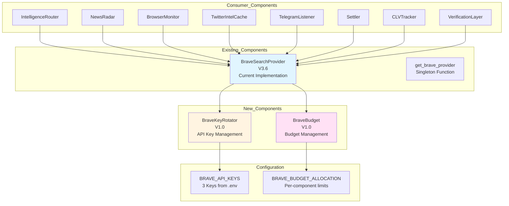

# Brave API Manager Architecture Plan
## API Key Rotation Enhancement

**Status:** READ ONLY - Planning Phase  
**Version:** 1.1 (Simplified)  
**Date:** 2026-01-31

---

## Executive Summary

Enhance the existing [`BraveSearchProvider`](src/ingestion/brave_provider.py:32) with API key rotation and budget management, following the same patterns as Tavily. This is a credit enhancement only - keep current implementation, settings, and usage patterns unchanged.

**Key Requirements:**
- Add 3 Brave API keys (2000 calls each = 6000/month baseline)
- Double-cycle support: Up to 12,000 calls/month via monthly reset
- Same key rotation rules as TavilyKeyRotator
- Same budget management rules as TavilyBudget
- Do NOT modify existing Brave browser integration
- Keep current BraveSearchProvider interface unchanged
- READ ONLY - Plan only, no code changes yet

**Provided API Keys:**
1. `BSA8GEZcqohA9G8L3-p6FJbzin4D-OF`
2. `BSAr_BZ95Sa2w1mqPnHtGZ2YeEGLo0x`
3. `BSADXYY9dy2id0ftdIERVlFRJHSpmO-`

---

## Architecture Overview

### Mermaid Diagram: Brave API Enhancement



---

## Component Specifications

### 1. BraveKeyRotator (V1.0)
**Duplicate of:** [`TavilyKeyRotator`](src/ingestion/tavily_key_rotator.py:19)

**File:** `src/ingestion/brave_key_rotator.py` (NEW)

**Features:**
- 3 API keys (2000 calls each = 6000/month baseline)
- Double-cycle support: Up to 12,000 calls/month via monthly reset
- Round-robin rotation on 429 errors
- Per-key usage tracking
- Automatic monthly reset
- Cycle counting for monitoring

**Key Methods:**
- `get_current_key()` - Get current active API key
- `rotate_to_next()` - Rotate to next available key
- `mark_exhausted()` - Mark a key as exhausted (429 error)
- `record_call()` - Record a successful API call
- `reset_all()` - Reset all keys to available status
- `get_status()` - Get rotation status for monitoring
- `is_available()` - Check if at least one key is available

**Configuration:**
- `BRAVE_API_KEYS` - List of 3 API keys from environment
  - `BRAVE_API_KEY_1`: `BSA8GEZcqohA9G8L3-p6FJbzin4D-OF`
  - `BRAVE_API_KEY_2`: `BSAr_BZ95Sa2w1mqPnHtGZ2YeEGLo0x`
  - `BRAVE_API_KEY_3`: `BSADXYY9dy2id0ftdIERVlFRJHSpmO-`

---

### 2. BraveBudget (V1.0)
**Duplicate of:** [`TavilyBudget`](src/ingestion/tavily_budget.py:38)

**File:** `src/ingestion/brave_budget.py` (NEW)

**Features:**
- Monthly limit: 6000 calls (3 keys × 2000 calls)
- Per-component allocation with tiered throttling
- Daily/monthly automatic resets
- Critical component tracking (always allowed in degraded mode)

**Key Methods:**
- `can_call()` - Check if component can make a Brave call
- `record_call()` - Record a Brave API call
- `get_status()` - Get current budget status
- `reset_monthly()` - Reset monthly counters
- `get_remaining_budget()` - Get remaining monthly budget
- `get_component_remaining()` - Get remaining budget for specific component

**Configuration:**
- `BRAVE_MONTHLY_BUDGET` - Total monthly limit (default: 6000)
- `BRAVE_BUDGET_ALLOCATION` - Per-component limits
- `BRAVE_DEGRADED_THRESHOLD` - Threshold for degraded mode (default: 0.90)
- `BRAVE_DISABLED_THRESHOLD` - Threshold for disabled mode (default: 0.95)

**Budget Allocation:**
```python
BRAVE_BUDGET_ALLOCATION = {
    "main_pipeline": 1800,      # 30% - Match enrichment
    "news_radar": 1200,         # 20% - Pre-enrichment
    "browser_monitor": 600,     # 10% - Content expansion
    "telegram_monitor": 300,    # 5% - Intel verification
    "settlement_clv": 150,      # 2.5% - Post-match analysis
    "twitter_recovery": 1950,   # 32.5% - Buffer/recovery
}
```

---

### 3. BraveSearchProvider Enhancement (V3.6 → V4.0)
**File:** `src/ingestion/brave_provider.py` (MODIFY)

**Changes:**
- Integrate BraveKeyRotator for key rotation
- Integrate BraveBudget for budget management
- Keep existing interface unchanged
- Keep existing rate limiting
- Keep existing caching
- Keep existing fallback logic

**Key Modifications:**
- Add `BraveKeyRotator` instance
- Add `BraveBudget` instance
- Update `search_news()` to use key rotation
- Add budget checks before API calls
- Record calls in budget manager
- Handle 429 errors with key rotation

**No Breaking Changes:**
- `search_news()` signature unchanged
- Return type unchanged
- All consumer components continue to work without modification

---

## Configuration Updates

### File: `config/settings.py`

Add new configuration section after existing BRAVE_API_KEY:

```python
# ========================================
# BRAVE SEARCH API CONFIGURATION (V4.0)
# ========================================
# Brave Search API - 3 API keys with 2000 calls each = 6000 calls/month
# Keys rotate automatically: when Key 1 exhausts (429), switches to Key 2, etc.
# https://brave.com/search/api/ - High-quality search for match enrichment

# Existing (keep unchanged)
BRAVE_API_KEY = os.getenv("BRAVE_API_KEY", "")

# NEW: API Keys for rotation (loaded in order)
BRAVE_API_KEYS = [
    os.getenv("BRAVE_API_KEY_1", "BSA8GEZcqohA9G8L3-p6FJbzin4D-OF"),
    os.getenv("BRAVE_API_KEY_2", "BSAr_BZ95Sa2w1mqPnHtGZ2YeEGLo0x"),
    os.getenv("BRAVE_API_KEY_3", "BSADXYY9dy2id0ftdIERVlFRJHSpmO-"),
]

# NEW: Budget allocation per component (calls/month)
BRAVE_BUDGET_ALLOCATION = {
    "main_pipeline": 1800,      # 30% - Match enrichment
    "news_radar": 1200,         # 20% - Pre-enrichment for ambiguous content
    "browser_monitor": 600,     # 10% - Short content expansion
    "telegram_monitor": 300,    # 5% - Intel verification
    "settlement_clv": 150,      # 2.5% - Post-match analysis
    "twitter_recovery": 1950,   # 32.5% - Buffer/recovery
}

# NEW: Total monthly budget (3 keys × 2000 calls)
BRAVE_MONTHLY_BUDGET = 6000

# NEW: Threshold percentages for degraded/disabled modes
BRAVE_DEGRADED_THRESHOLD = 0.90   # 90% - Non-critical calls throttled
BRAVE_DISABLED_THRESHOLD = 0.95   # 95% - Only critical calls allowed
```

### File: `.env`

Add to environment variables:

```bash
# Brave Search API Keys (V4.0 - Key Rotation)
BRAVE_API_KEY_1=BSA8GEZcqohA9G8L3-p6FJbzin4D-OF
BRAVE_API_KEY_2=BSAr_BZ95Sa2w1mqPnHtGZ2YeEGLo0x
BRAVE_API_KEY_3=BSADXYY9dy2id0ftdIERVlFRJHSpmO-
```

**Note:** Keep existing `BRAVE_API_KEY` for backward compatibility.

---

## Implementation Steps

### Phase 1: Core Components (NEW)
1. Create `src/ingestion/brave_key_rotator.py`
   - Duplicate TavilyKeyRotator logic
   - Adapt for 3 keys instead of 7
   - Implement double-cycle support
   - Add singleton pattern: `get_brave_key_rotator()`

2. Create `src/ingestion/brave_budget.py`
   - Duplicate TavilyBudget logic
   - Adapt for 6000 monthly limit
   - Configure budget allocations
   - Add singleton pattern: `get_brave_budget_manager()`

### Phase 2: Configuration (UPDATE)
3. Update `config/settings.py`
   - Add BRAVE_API_KEYS list with 3 keys
   - Add BRAVE_BUDGET_ALLOCATION
   - Add BRAVE_MONTHLY_BUDGET
   - Add BRAVE_DEGRADED_THRESHOLD
   - Add BRAVE_DISABLED_THRESHOLD
   - Keep existing BRAVE_API_KEY for backward compatibility

4. Update `.env` file (user action required)
   - Add BRAVE_API_KEY_1, BRAVE_API_KEY_2, BRAVE_API_KEY_3

### Phase 3: Integration (MODIFY)
5. Update `src/ingestion/brave_provider.py`
   - Import BraveKeyRotator and BraveBudget
   - Add key rotator instance to BraveSearchProvider
   - Add budget manager instance to BraveSearchProvider
   - Modify `search_news()` to use key rotation
   - Add budget checks before API calls
   - Record calls in budget manager
   - Handle 429 errors with key rotation
   - Keep existing interface unchanged
   - Keep existing rate limiting
   - Keep existing caching
   - Keep existing fallback logic

### Phase 4: Testing (NEW)
6. Create `tests/test_brave_key_rotator.py`
   - Key rotation logic tests
   - Double-cycle support tests
   - Monthly reset tests
   - Per-key usage tracking tests

7. Create `tests/test_brave_budget.py`
   - Budget allocation tests
   - Degraded mode tests
   - Disabled mode tests
   - Daily/monthly reset tests

8. Create `tests/test_brave_integration.py`
   - End-to-end search flow tests
   - Key rotation on 429 tests
   - Budget enforcement tests
   - Backward compatibility tests

---

## Key Features Summary

### High Availability
- 3 keys + double-cycle = 12,000 calls/month
- Automatic key rotation on 429 errors
- Monthly reset for double-cycle support

### Cost Efficiency
- Budget management with tiered throttling
- Per-component allocation tracking
- Degraded/disabled mode thresholds

### Reliability
- Thread-safe singleton pattern
- Per-key usage tracking
- Daily/monthly automatic resets

### Backward Compatibility
- Existing BraveSearchProvider interface unchanged
- All consumer components work without modification
- Existing rate limiting preserved
- Existing caching preserved
- Existing fallback logic preserved

---

## Exclusion Rules (from Tavily)

### Components that CAN use Brave (with budget allocation):
- main_pipeline (Match enrichment)
- news_radar (Pre-enrichment)
- browser_monitor (Content expansion)
- telegram_monitor (Intel verification)
- settlement_clv (Post-match analysis)
- twitter_recovery (Buffer/recovery)

### Critical Components (always allowed in degraded mode):
- main_pipeline
- settlement_clv

### Degraded Mode (>90% budget used):
- Non-critical components throttled to 50% of allocation
- Critical components unaffected

### Disabled Mode (>95% budget used):
- Only critical components allowed
- All non-critical calls blocked

---

## API Key Information

### Provided Brave API Keys:
1. `BSA8GEZcqohA9G8L3-p6FJbzin4D-OF`
2. `BSAr_BZ95Sa2w1mqPnHtGZ2YeEGLo0x`
3. `BSADXYY9dy2id0ftdIERVlFRJHSpmO-`

### Key Specifications:
- Each key: 2000 calls/month
- Total baseline: 6000 calls/month
- Double-cycle: Up to 12,000 calls/month
- Rate limit: 1 request/second
- Endpoint: `https://api.search.brave.com/res/v1/web/search`
- Auth: `X-Subscription-Token` header

---

## Comparison: Tavily vs Brave

| Feature | Tavily | Brave (Current) | Brave (Enhanced) |
|---------|--------|-----------------|------------------|
| API Keys | 7 keys | 1 key | 3 keys |
| Calls/Key | 1000 | 2000 | 2000 |
| Baseline Monthly | 7000 | 2000 | 6000 |
| Double-Cycle Monthly | 14000 | N/A | 12000 |
| Key Rotation | Yes | No | Yes |
| Budget Management | Yes | No | Yes |
| Rate Limit | 1 req/sec | 2 req/sec | 2 req/sec (existing) |
| Cache | 30 min | None | None (existing) |
| Circuit Breaker | Yes | No | No (existing) |
| Fallbacks | Brave, DDG | DDG | DDG (existing) |

---

## Consumer Components (8 total)

All components continue to use existing `get_brave_provider()` - no changes needed:

1. **IntelligenceRouter** - Match enrichment, biscotto detection
2. **NewsRadar** - News monitoring
3. **BrowserMonitor** - Web content expansion
4. **TwitterIntelCache** - Tweet recovery
5. **TelegramListener** - Intel verification
6. **Settler** - Post-match analysis
7. **CLVTracker** - Line movement verification
8. **VerificationLayer** - Match data verification

---

## Testing Strategy

### Unit Tests
- Key rotation logic
- Double-cycle support
- Budget management
- Monthly reset behavior
- Per-key usage tracking

### Integration Tests
- End-to-end search flow with key rotation
- Key rotation on 429 errors
- Budget enforcement
- Backward compatibility with existing usage

### Property-Based Tests
- Double-cycle rotation
- Monthly reset behavior
- Budget allocation distribution

### Regression Tests
- Verify existing Brave functionality preserved
- Verify consumer components work correctly
- Verify no breaking changes

---

## Migration Notes

### Backward Compatibility
- **NO BREAKING CHANGES**
- Existing `BraveSearchProvider` interface unchanged
- Consumer components work without modification
- Existing rate limiting preserved
- Existing caching preserved
- Existing fallback logic preserved

### Enhancement Only
- Add key rotation internally
- Add budget management internally
- No API changes
- No import changes needed

### Rollback Plan
- Feature flag: `BRAVE_KEY_ROTATION_ENABLED` (default: True)
- Can disable key rotation if issues arise
- Falls back to single key mode (existing behavior)

---

## Success Criteria

- [ ] BraveKeyRotator implemented and tested
- [ ] BraveBudget implemented and tested
- [ ] Configuration updated in settings.py
- [ ] BraveSearchProvider enhanced with key rotation
- [ ] BraveSearchProvider enhanced with budget management
- [ ] Unit tests pass (90%+ coverage)
- [ ] Integration tests pass
- [ ] Property-based tests pass
- [ ] Regression tests pass
- [ ] No breaking changes to existing functionality
- [ ] All consumer components work without modification

---

## Next Steps

1. ✅ **Review this plan** with user for approval
2. ✅ **Answer open questions** based on user feedback
3. **Switch to Code mode** for implementation
4. **Implement Phase 1** (Core Components - BraveKeyRotator, BraveBudget)
5. **Implement Phase 2** (Configuration - settings.py, .env)
6. **Implement Phase 3** (Integration - enhance BraveSearchProvider)
7. **Implement Phase 4** (Testing - unit tests, integration tests)

---

**Plan Status:** ✅ Approved - Ready for Implementation  
**Last Updated:** 2026-01-31
