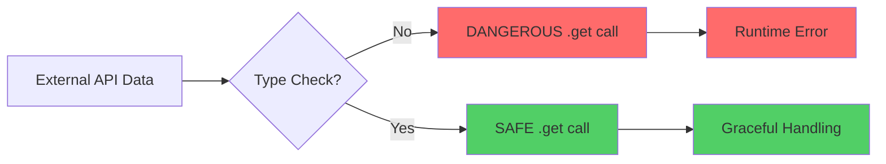
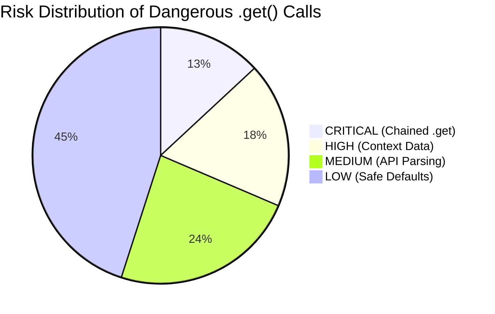
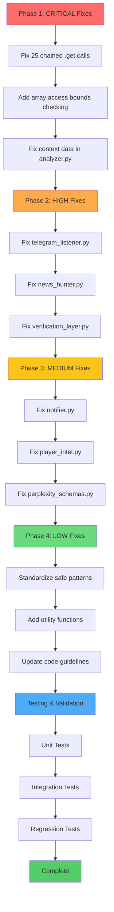

# Dangerous `.get()` Calls - Execution Plan

## Overview

This plan addresses the critical issue of 191 potentially dangerous `.get()` calls without `isinstance()` type checking, which can cause runtime crashes similar to the fatigue bug.

## Problem Summary



## Risk Distribution



## Execution Workflow



## Phase 1: CRITICAL Fixes (Immediate Action)

### 1.1 Fix Chained `.get()` Calls (25 instances)

**Files to modify:**
- [`src/analysis/final_alert_verifier.py`](src/analysis/final_alert_verifier.py:205)
- [`src/analysis/settler.py`](src/analysis/settler.py:241-242,271-272)
- [`src/analysis/optimizer.py`](src/analysis/optimizer.py:433,477-479,800-801,902,948)
- [`src/ingestion/data_provider.py`](src/ingestion/data_provider.py:875-877,1097,1189,1209)
- [`src/ingestion/opportunity_radar.py`](src/ingestion/opportunity_radar.py:374,399)
- [`src/ingestion/brave_provider.py`](src/ingestion/brave_provider.py:175)
- [`src/ingestion/deepseek_intel_provider.py`](src/ingestion/deepseek_intel_provider.py:348)
- [`src/ingestion/tavily_provider.py`](src/ingestion/tavily_provider.py:605)
- [`src/services/news_radar.py`](src/services/news_radar.py:1467)
- [`src/utils/inspect_fotmob.py`](src/utils/inspect_fotmob.py:51-52,81,193-194)
- [`src/utils/http_client.py`](src/utils/http_client.py:1078)
- [`src/utils/check_apis.py`](src/utils/check_apis.py:226,285,343)

**Example fix:**

```python
# BEFORE (DANGEROUS)
value = data.get('key1', {}).get('key2')

# AFTER (SAFE)
data1 = data.get('key1')
if isinstance(data1, dict):
    value = data1.get('key2')
else:
    value = None  # or appropriate default
```

### 1.2 Add Array Access Bounds Checking

**High-risk patterns:**
- `choices[0].get(...)` in [`deepseek_intel_provider.py:348`](src/ingestion/deepseek_intel_provider.py:348)
- `data.get("choices", [{}])[0].get(...)` in [`check_apis.py:226,343`](src/utils/check_apis.py:226)

**Example fix:**

```python
# BEFORE (DANGEROUS)
content = choices[0].get("message", {}).get("content", "")

# AFTER (SAFE)
content = ""
if choices and isinstance(choices, list) and len(choices) > 0:
    message = choices[0].get("message", {}) if isinstance(choices[0], dict) else {}
    content = message.get("content", "")
```

### 1.3 Fix Context Data Access in analyzer.py

**Lines to fix:** 1324-1330, 1344-1349, 1524-1525

**Example fix:**

```python
# BEFORE (DANGEROUS)
home_rank = league_table_context.get('home_rank')

# AFTER (SAFE)
home_rank = None
if league_table_context and isinstance(league_table_context, dict):
    home_rank = league_table_context.get('home_rank')
```

## Phase 2: HIGH Fixes (Next Sprint)

### 2.1 Fix telegram_listener.py

**Lines to fix:** 787-789, 808-809, 815, 824-825, 832, 840-841, 847, 855-856, 861-862

**Example fix:**

```python
# BEFORE (DANGEROUS)
full_text = squad.get('full_text', squad.get('caption', ''))

# AFTER (SAFE)
full_text = ""
if squad and isinstance(squad, dict):
    full_text = squad.get('full_text', squad.get('caption', ''))
```

### 2.2 Fix news_hunter.py

**Lines to fix:** 1038-1043, 1208-1212

**Example fix:**

```python
# BEFORE (DANGEROUS)
title = item.get('title')

# AFTER (SAFE)
title = ""
if item and isinstance(item, dict):
    title = item.get('title', '')
```

### 2.3 Fix verification_layer.py

**Lines to fix:** 1126-1195

**Example fix:**

```python
# BEFORE (DANGEROUS)
home_corners = home_stats.get('corners')

# AFTER (SAFE)
home_corners = None
if home_stats and isinstance(home_stats, dict):
    home_corners = home_stats.get('corners')
```

## Phase 3: MEDIUM Fixes (Following Sprint)

### 3.1 Fix notifier.py

**Lines to fix:** 329-332, 382-387, 449-455, 505-508, 545-548

### 3.2 Fix player_intel.py

**Lines to fix:** 66-67, 74-75, 96-99

### 3.3 Fix perplexity_schemas.py

**Lines to fix:** 271-273, 307-309

## Phase 4: LOW Fixes (Ongoing Maintenance)

### 4.1 Standardize Safe Patterns

Apply consistent safe patterns across all remaining files.

### 4.2 Add Utility Functions

Create helper functions in [`src/utils/validators.py`](src/utils/validators.py):

```python
def safe_get(data, *keys, default=None):
    """Safely access nested dictionary keys with type checking."""
    current = data
    for key in keys:
        if isinstance(current, dict):
            current = current.get(key)
            if current is None:
                return default
        else:
            return default
    return current if current is not None else default


def safe_list_get(data, index, default=None):
    """Safely access list elements with bounds checking."""
    if isinstance(data, list) and 0 <= index < len(data):
        return data[index]
    return default
```

### 4.3 Update Code Style Guidelines

Add rules requiring:
- `isinstance()` checks before nested `.get()` calls
- Bounds checking for array access
- Defensive programming for external API data

## Testing Strategy

### Unit Tests

Create tests in [`tests/test_safe_get_patterns.py`](tests/test_safe_get_patterns.py):

```python
def test_get_with_string_value():
    """Test that .get() handles string values instead of dicts."""
    context = {'fatigue': 'high'}
    result = extract_fatigue_level(context)
    assert result == 'high' or result == 'Unknown'


def test_get_with_none_value():
    """Test that .get() handles None values."""
    context = {'fatigue': None}
    result = extract_fatigue_level(context)
    assert result == 'Unknown'


def test_get_with_missing_key():
    """Test that .get() handles missing keys."""
    context = {}
    result = extract_fatigue_level(context)
    assert result == 'Unknown'


def test_nested_get_with_invalid_intermediate():
    """Test that nested .get() handles non-dict intermediate values."""
    data = {'level1': 'not_a_dict'}
    result = safe_get(data, 'level1', 'level2')
    assert result is None
```

### Integration Tests

Test with real-world data:
- FotMob API responses (including edge cases)
- Telegram messages in various formats
- API responses from Brave, Tavily, Perplexity

### Regression Tests

Ensure existing functionality is not broken by the fixes.

## Code Review Checklist

When reviewing code with `.get()` calls:

- [ ] Is there an `isinstance()` check before calling `.get()` on a potentially non-dict value?
- [ ] Are chained `.get()` calls protected with type checking?
- [ ] Is there a fallback/default value for unexpected types?
- [ ] Are API responses validated before accessing nested data?
- [ ] Is there error handling for AttributeError exceptions?
- [ ] Are there tests for edge cases (string, None, missing keys)?

## Estimated Impact

### Benefits
- **Prevent crashes**: Eliminate runtime errors from unexpected data types
- **Improve reliability**: More robust handling of external API data
- **Better debugging**: Clearer error messages and logging
- **Maintainability**: Consistent safe patterns across codebase

### Risks
- **Breaking changes**: Some fixes may change behavior (e.g., returning None instead of crashing)
- **Performance**: Additional isinstance checks may have minimal performance impact
- **Testing effort**: Requires comprehensive test coverage

## Success Criteria

- [ ] All CRITICAL and HIGH risk fixes implemented
- [ ] Unit tests pass for all edge cases
- [ ] Integration tests pass with real API data
- [ ] No regression in existing functionality
- [ ] Code review guidelines updated
- [ ] Team trained on safe patterns

## Next Steps

1. **Review this plan** with the team
2. **Switch to Code mode** to begin implementation
3. **Start with Phase 1 (CRITICAL fixes)**
4. **Test each fix** before proceeding
5. **Document lessons learned** for future reference

---

**Status**: Ready for Implementation  
**Priority**: CRITICAL  
**Estimated Effort**: 4-6 phases across multiple sprints
