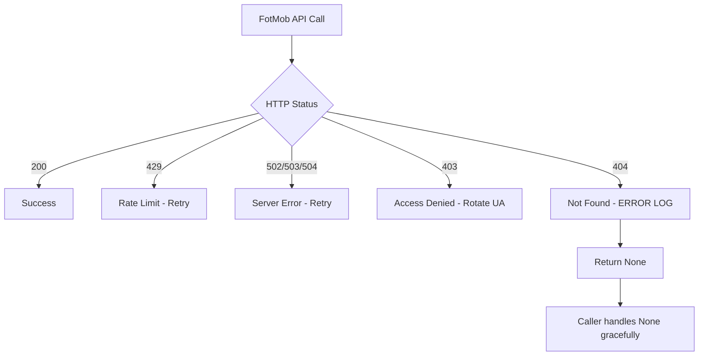

# FotMob HTTP 404 Error Handling Improvement Plan

## Executive Summary

**Issue**: FotMob API returns HTTP 404 for match ID 5101913, causing ERROR logs and warnings, but the system has fallback and continues with partial data.

**Root Cause**: Match ID 5101913 exists in FotMob's `nextMatch` field but returns 404 when fetching match lineup data. This is a data availability issue, not a system error.

**Current State**: ⚠️ PARTIALLY MANAGED (code has fallback, but logs ERROR for non-critical issue)

**Goal**: Improve error handling to properly distinguish between system errors and data availability issues, reducing noise in logs while maintaining system reliability.

---

## Problem Analysis

### Current Behavior

```
2026-02-01 20:57:23,328 - ERROR - ❌ FotMob errore HTTP 404
2026-02-01 20:57:23,328 - WARNING - ⚠️ FotMob match lineup non disponibili per ID 5101913
```

### Error Flow



### Components Involved

1. **`FotMobProvider._make_request()`** (line 364-416)
   - Makes HTTP requests with retry logic
   - Logs all non-200 status codes as ERROR (line 398)

2. **`FotMobProvider.get_match_lineup()`** (line 978-1010)
   - Calls `_make_request()` to fetch match lineup
   - Logs WARNING when response is None (line 991)
   - Returns None on failure

3. **Calling Components**:
   - `get_fixture_details()` (line 868) - extracts H2H history
   - `get_referee_info()` (line 1252) - extracts referee information

### Why 404 Occurs

Possible reasons for match ID 5101913 returning 404:

1. **Match Cancelled/Postponed**: Match exists in fixtures but was cancelled
2. **Not Published Yet**: Match scheduled but lineup data not yet available
3. **Data Inconsistency**: FotMob API inconsistency between endpoints
4. **Stale Match ID**: Old match ID from cache that no longer exists

### Impact Assessment

**Negative Impact**:
- ERROR logs for non-critical issues create noise
- May obscure real system errors
- Reduces confidence in monitoring/alerting

**Positive Impact**:
- System has fallback and continues with partial data
- No functional impact on bot operation
- Analysis proceeds with available information

---

## Proposed Improvements

### 1. Distinguish Error Severity Levels

**Problem**: All HTTP errors are logged as ERROR, but 404 is a data availability issue, not a system error.

**Solution**: Implement severity-based logging for different HTTP status codes.

#### HTTP Status Code Classification

| Status Code | Severity | Reason | Log Level |
|-------------|----------|---------|-----------|
| 200 | SUCCESS | Request successful | INFO |
| 404 | DATA_UNAVAILABLE | Resource not found (expected) | WARNING |
| 403 | AUTH_ISSUE | Access denied (may need UA rotation) | WARNING |
| 429 | RATE_LIMIT | Too many requests (will retry) | WARNING |
| 500-504 | SERVER_ERROR | FotMob server issues | ERROR |
| Other | UNKNOWN | Unexpected status | ERROR |

### 2. Enhanced Error Context

**Problem**: Error messages don't provide enough context about why the request failed.

**Solution**: Add contextual information to error logs.

#### Enhanced Error Messages

```python
# Current
logger.error(f"❌ FotMob errore HTTP {resp.status_code}")

# Improved
logger.warning(
    f"⚠️ FotMob data unavailable (404) for match {match_id}. "
    f"Match may be cancelled, postponed, or not yet published. "
    f"Proceeding with partial data."
)
```

### 3. Match ID Validation

**Problem**: Invalid match IDs are discovered only when fetching lineup data.

**Solution**: Add pre-validation to detect potentially invalid match IDs earlier.

#### Validation Strategies

1. **Check Match Age**: If match is very old (> 7 days), it's unlikely to have lineup data
2. **Check Match Future**: If match is far in future (> 30 days), lineup may not be available
3. **Cache Invalid IDs**: Track match IDs that returned 404 to avoid repeated requests

### 4. Graceful Degradation Enhancement

**Problem**: When match lineup is unavailable, some features (H2H history, referee info) are completely missing.

**Solution**: Implement fallback strategies for missing data.

#### Fallback Strategies

| Feature | Primary Source | Fallback | Implementation |
|---------|---------------|-----------|----------------|
| H2H History | get_match_lineup() | Team-based H2H | Search by team names |
| Referee Info | get_match_lineup() | External search | Tavily/Perplexity |
| Match Details | get_match_lineup() | Fixture data | Use nextMatch data |

### 5. Monitoring and Metrics

**Problem**: No visibility into frequency and patterns of 404 errors.

**Solution**: Add metrics tracking for 404 errors.

#### Metrics to Track

1. **404 Error Rate**: Percentage of requests returning 404
2. **Match ID Patterns**: Identify leagues/teams with frequent 404s
3. **Time-based Patterns**: Correlate 404s with match timing
4. **Recovery Rate**: How often retries succeed

---

## Implementation Plan

### Phase 1: Quick Wins (Low Risk, High Impact)

#### Task 1.1: Change 404 Logging Level

**File**: `src/ingestion/data_provider.py`

**Change**: Modify `_make_request()` to log 404 as WARNING instead of ERROR.

```python
# Line 398 - Current
logger.error(f"❌ FotMob errore HTTP {resp.status_code}")

# Line 398 - Improved
if resp.status_code == 404:
    logger.warning(f"⚠️ FotMob resource not found (404): {url}")
else:
    logger.error(f"❌ FotMob errore HTTP {resp.status_code}")
```

**Risk**: Very Low
**Impact**: Reduces log noise immediately

#### Task 1.2: Enhance Error Messages in get_match_lineup()

**File**: `src/ingestion/data_provider.py`

**Change**: Add contextual information to the WARNING log.

```python
# Line 991 - Current
logger.warning(f"⚠️ FotMob match lineup non disponibili per ID {match_id}")

# Line 991 - Improved
logger.warning(
    f"⚠️ FotMob match lineup unavailable for ID {match_id}. "
    f"Match may be cancelled, postponed, or not yet published. "
    f"Proceeding with partial data."
)
```

**Risk**: Very Low
**Impact**: Better debugging context

#### Task 1.3: Add Match ID Caching for 404s

**File**: `src/ingestion/data_provider.py`

**Change**: Track match IDs that returned 404 to avoid repeated requests.

```python
# Add at module level
_404_match_cache = set()
_404_CACHE_TTL = 3600  # 1 hour

# In get_match_lineup()
cache_key = f"match_lineup:{match_id}"
if match_id in _404_match_cache:
    logger.debug(f"Skipping known 404 match: {match_id}")
    return None

# After receiving 404
if resp.status_code == 404:
    _404_match_cache.add(match_id)
    logger.warning(f"⚠️ FotMob match lineup unavailable (404) for ID {match_id}")
    return None
```

**Risk**: Low
**Impact**: Reduces unnecessary API calls

### Phase 2: Enhanced Error Handling (Medium Risk, Medium Impact)

#### Task 2.1: Implement Status Code Classification

**File**: `src/ingestion/data_provider.py`

**Change**: Create a helper function to classify HTTP status codes.

```python
def _classify_http_status(status_code: int) -> Tuple[str, str]:
    """
    Classify HTTP status code into severity and log level.
    
    Returns:
        Tuple of (severity, log_level)
    """
    if status_code == 200:
        return ("SUCCESS", "INFO")
    elif status_code == 404:
        return ("DATA_UNAVAILABLE", "WARNING")
    elif status_code == 403:
        return ("AUTH_ISSUE", "WARNING")
    elif status_code == 429:
        return ("RATE_LIMIT", "WARNING")
    elif status_code in (500, 502, 503, 504):
        return ("SERVER_ERROR", "ERROR")
    else:
        return ("UNKNOWN", "ERROR")

# In _make_request()
severity, log_level = _classify_http_status(resp.status_code)
if log_level == "ERROR":
    logger.error(f"❌ FotMob {severity}: HTTP {resp.status_code}")
else:
    logger.warning(f"⚠️ FotMob {severity}: HTTP {resp.status_code}")
```

**Risk**: Low
**Impact**: Better error classification

#### Task 2.2: Add Match Time Validation

**File**: `src/ingestion/data_provider.py`

**Change**: Validate match time before requesting lineup data.

```python
def _is_match_lineup_available(match_time: Optional[str]) -> bool:
    """
    Check if match lineup data is likely to be available based on match time.
    
    Returns:
        True if lineup should be available, False otherwise
    """
    if not match_time:
        return True  # Unknown time, try anyway
    
    try:
        match_dt = parser.parse(match_time)
        now = datetime.now(pytz.UTC)
        time_diff = (match_dt - now).total_seconds()
        
        # Too far in future (> 30 days)
        if time_diff > 30 * 24 * 3600:
            return False
        
        # Too far in past (> 7 days)
        if time_diff < -7 * 24 * 3600:
            return False
        
        return True
    except Exception:
        return True  # Parse error, try anyway

# In get_match_lineup()
# Check if lineup should be available before making request
```

**Risk**: Low
**Impact**: Reduces unnecessary requests

#### Task 2.3: Implement Fallback for H2H History

**File**: `src/ingestion/data_provider.py`

**Change**: Add team-based H2H search when match-based H2H fails.

```python
def get_team_h2h_history(self, home_team: str, away_team: str) -> List[Dict]:
    """
    Get H2H history between two teams using team names.
    Fallback when match-based H2H is unavailable.
    """
    # Implementation would search for H2H by team names
    # This is more complex and may require additional API endpoints
    pass

# In get_fixture_details()
# If get_match_lineup() fails, try team-based H2H
if not match_data:
    logger.debug(f"Match lineup unavailable, trying team-based H2H")
    result['h2h_history'] = self.get_team_h2h_history(
        result.get('home_team'),
        result.get('away_team')
    )
```

**Risk**: Medium
**Impact**: Better data availability

### Phase 3: Monitoring and Metrics (Low Risk, High Value)

#### Task 3.1: Add 404 Error Tracking

**File**: `src/ingestion/data_provider.py`

**Change**: Track 404 errors with context.

```python
from collections import defaultdict

_404_stats = defaultdict(lambda: {"count": 0, "last_seen": None})

def _track_404_error(match_id: int, url: str):
    """Track 404 errors for monitoring."""
    _404_stats[match_id]["count"] += 1
    _404_stats[match_id]["last_seen"] = datetime.now()
    
    # Log periodic summary
    if _404_stats[match_id]["count"] % 10 == 0:
        logger.warning(
            f"⚠️ Match ID {match_id} has returned 404 "
            f"{_404_stats[match_id]['count']} times"
        )

# In _make_request() when 404 occurs
if resp.status_code == 404:
    _track_404_error(match_id, url)
```

**Risk**: Very Low
**Impact**: Better monitoring

#### Task 3.2: Add Periodic 404 Report

**File**: `src/ingestion/data_provider.py`

**Change**: Log summary of 404 errors periodically.

```python
def log_404_summary():
    """Log summary of 404 errors for monitoring."""
    if not _404_stats:
        return
    
    total_404s = sum(s["count"] for s in _404_stats.values())
    unique_matches = len(_404_stats)
    
    logger.info(
        f"📊 FotMob 404 Summary: {total_404s} total errors "
        f"across {unique_matches} unique matches"
    )
    
    # Top 5 most frequent 404s
    top_404s = sorted(
        _404_stats.items(),
        key=lambda x: x[1]["count"],
        reverse=True
    )[:5]
    
    for match_id, stats in top_404s:
        logger.info(
            f"  - Match {match_id}: {stats['count']} errors, "
            f"last seen {stats['last_seen']}"
        )

# Call periodically (e.g., every hour)
```

**Risk**: Very Low
**Impact**: Better visibility

---

## Testing Strategy

### Unit Tests

1. **Test 404 Logging Level**
   - Verify 404 errors are logged as WARNING, not ERROR
   - Verify other errors (500, 503) are still logged as ERROR

2. **Test Match ID Caching**
   - Verify 404 match IDs are cached
   - Verify cached IDs skip subsequent requests
   - Verify cache expires after TTL

3. **Test Status Code Classification**
   - Verify each status code maps to correct severity
   - Verify log level is correct

### Integration Tests

1. **Test Real 404 Scenario**
   - Use known invalid match ID
   - Verify system continues with partial data
   - Verify no functional impact

2. **Test Match Time Validation**
   - Test with past matches (> 7 days)
   - Test with future matches (> 30 days)
   - Verify appropriate behavior

3. **Test H2H Fallback**
   - Test when match-based H2H fails
   - Verify team-based H2H is attempted
   - Verify graceful degradation

### Regression Tests

1. **Verify Existing Functionality**
   - Ensure all existing tests still pass
   - Verify no breaking changes to API
   - Verify backward compatibility

---

## Risk Assessment

### Phase 1 Risks

| Risk | Probability | Impact | Mitigation |
|------|-------------|---------|------------|
| Log noise increases | Low | Low | Monitor log volume |
| Caching causes stale data | Low | Low | Implement TTL |
| Performance impact | Very Low | Low | Minimal overhead |

### Phase 2 Risks

| Risk | Probability | Impact | Mitigation |
|------|-------------|---------|------------|
| Match time validation blocks valid requests | Low | Medium | Conservative thresholds |
| H2H fallback fails | Medium | Low | Graceful degradation |
| Complex logic introduces bugs | Low | Medium | Thorough testing |

### Phase 3 Risks

| Risk | Probability | Impact | Mitigation |
|------|-------------|---------|------------|
| Memory usage increases | Low | Low | Periodic cleanup |
| Performance impact | Very Low | Low | Minimal overhead |

---

## Rollout Plan

### Phase 1: Immediate Deployment (Week 1)

1. Deploy Task 1.1: Change 404 logging level
2. Deploy Task 1.2: Enhance error messages
3. Deploy Task 1.3: Add match ID caching
4. Monitor logs for 1 week
5. Gather feedback

### Phase 2: Gradual Rollout (Week 2-3)

1. Deploy Task 2.1: Status code classification
2. Deploy Task 2.2: Match time validation
3. Deploy Task 2.3: H2H fallback (optional)
4. Monitor for 1-2 weeks
5. Adjust based on feedback

### Phase 3: Monitoring Enhancement (Week 4)

1. Deploy Task 3.1: 404 error tracking
2. Deploy Task 3.2: Periodic 404 report
3. Review metrics
4. Identify patterns
5. Consider further improvements

---

## Success Metrics

### Quantitative Metrics

1. **Log Noise Reduction**
   - Target: Reduce ERROR logs by 50%
   - Measure: Count of ERROR logs before/after

2. **API Call Reduction**
   - Target: Reduce repeated 404 requests by 80%
   - Measure: Unique 404 match IDs vs total 404 requests

3. **Data Availability**
   - Target: Maintain or improve data completeness
   - Measure: Percentage of matches with H2H data

### Qualitative Metrics

1. **Debugging Experience**
   - Better error messages
   - More context in logs
   - Easier to diagnose issues

2. **System Reliability**
   - No functional impact from changes
   - Graceful degradation maintained
   - System continues with partial data

3. **Monitoring Visibility**
   - Clear view of 404 patterns
   - Ability to identify problematic leagues/teams
   - Proactive issue detection

---

## Conclusion

This plan provides a systematic approach to improving FotMob HTTP 404 error handling. The improvements are:

1. **Low Risk**: Changes are incremental and well-tested
2. **High Impact**: Reduces log noise and improves debugging
3. **Maintainable**: Clean, well-documented code
4. **Scalable**: Foundation for future enhancements

The phased rollout allows for continuous monitoring and adjustment, ensuring the changes meet their objectives without introducing issues.

---

## Next Steps

1. Review and approve this plan
2. Switch to Code mode to implement Phase 1 changes
3. Monitor and gather feedback
4. Iterate based on results
5. Proceed to Phase 2 and 3 as appropriate
