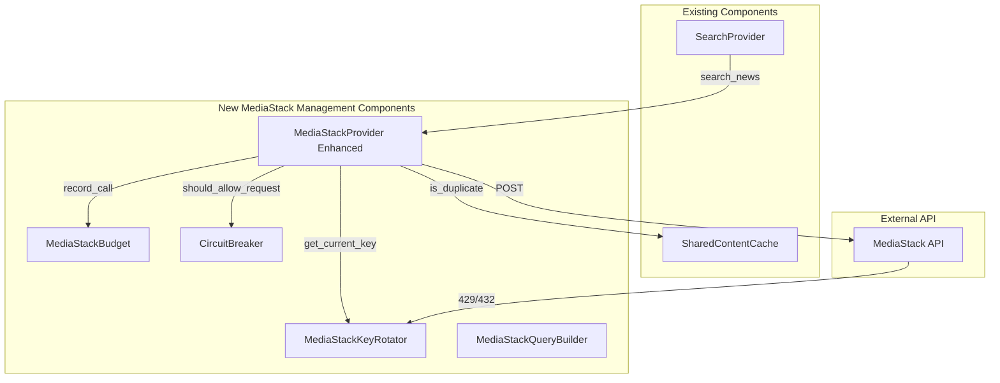
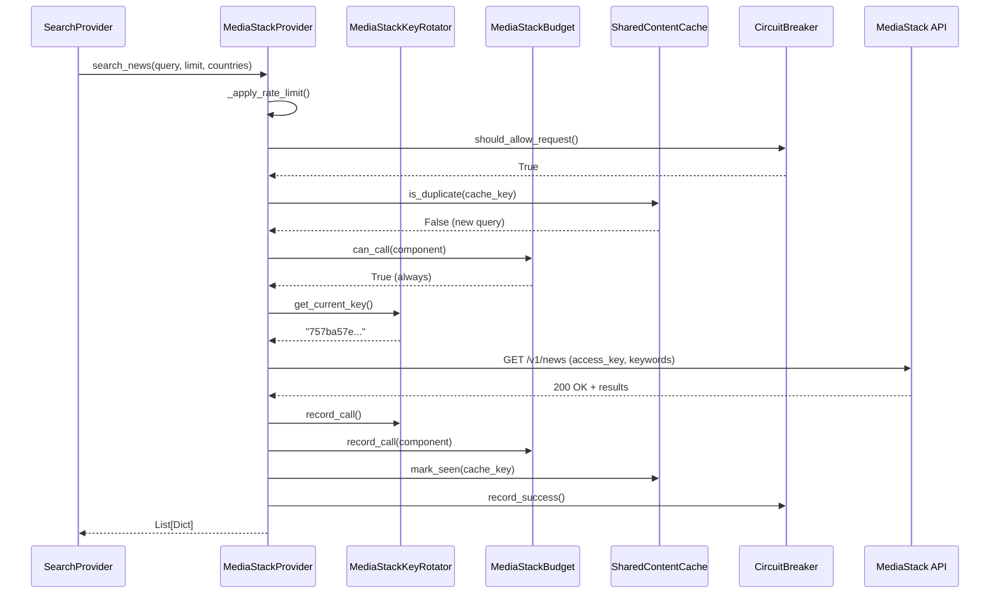
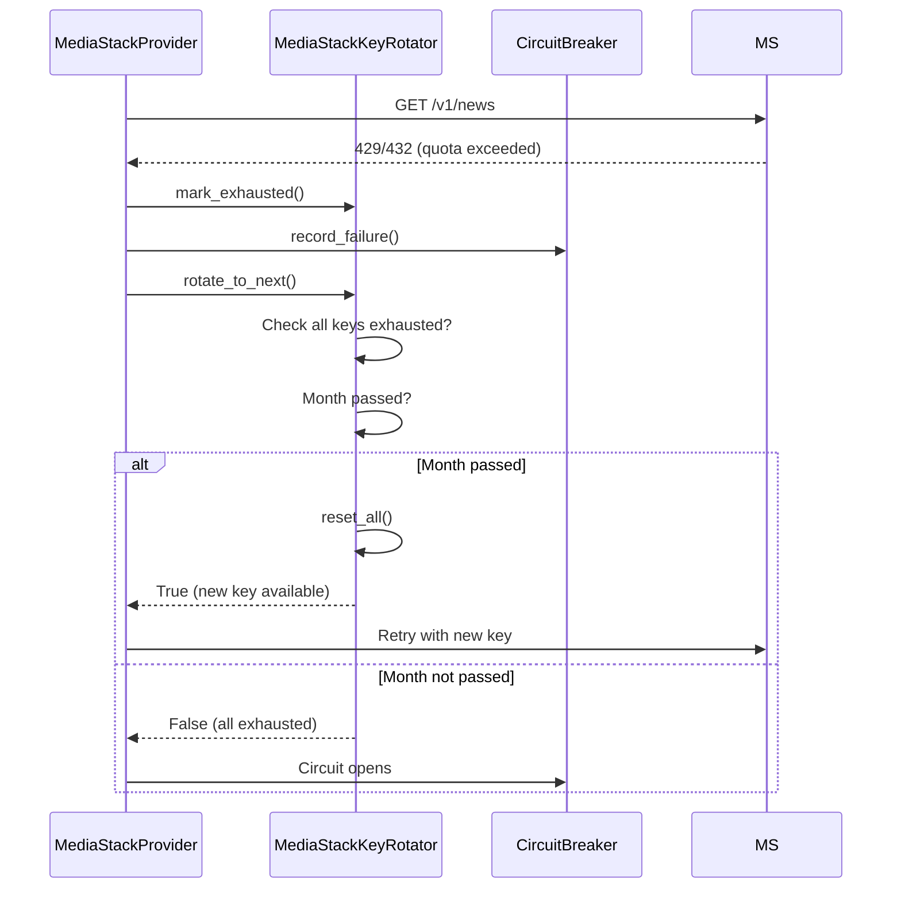

# MediaStack API - Tavily-like Architecture Implementation Plan

## Executive Summary

This plan outlines the implementation of Tavily-like architecture components for MediaStack API. The goal is to add API key rotation, budget management, circuit breaker pattern, and cross-component deduplication to the existing MediaStack integration.

**Important Notes:**
- MediaStack is already connected correctly in the bot - NO changes to existing integration
- Only adding management components (rotation, budget, circuit breaker, caching)
- MediaStack is FREE unlimited tier - budget is for monitoring only, not throttling
- 4 API keys provided by user (each from a different MediaStack account)
- HTTPS is available on ALL plans (including free tier) - should support both HTTP and HTTPS

## Official MediaStack API Documentation

### Authentication
- **Method:** `access_key` GET parameter
- **Example:** `http://api.mediastack.com/v1/news?access_key=YOUR_API_KEY`
- **HTTPS Support:** Available on ALL plans (256-bit SSL encryption)
- **Key Per Account:** One API key per account (keys don't change unless manually regenerated)

### API Endpoint
- **HTTP:** `http://api.mediastack.com/v1/news`
- **HTTPS:** `https://api.mediastack.com/v1/news`
- **Recommendation:** Use HTTPS for better security

---

## Current MediaStack Implementation

### Existing Components

| Component | File | Description |
|----------|------|-------------|
| [`MediastackProvider`](src/ingestion/mediastack_provider.py:125) | `src/ingestion/mediastack_provider.py` | Basic API wrapper with query sanitization and post-fetch filtering |
| [`SearchProvider`](src/ingestion/search_provider.py:233) | `src/ingestion/search_provider.py` | Uses Mediastack as emergency fallback (Layer 2) |

### Current Limitations

1. **Single API Key** - No rotation mechanism
2. **No Budget Management** - No usage tracking per component
3. **No Circuit Breaker** - No resilience pattern for failures
4. **No Rate Limiting** - No request throttling
5. **No Caching** - No local cache to prevent duplicate requests
6. **No Deduplication** - No cross-component duplicate detection

---

## Proposed Architecture

### New Components to Create



### Component Mapping (Tavily → MediaStack)

| Tavily Component | MediaStack Component | Status | Notes |
|------------------|---------------------|--------|-------|
| [`TavilyProvider`](src/ingestion/tavily_provider.py:196) | [`MediaStackProvider`](src/ingestion/mediastack_provider.py:125) | **Enhance** | Add rate limiting, circuit breaker, caching, deduplication |
| [`TavilyKeyRotator`](src/ingestion/tavily_key_rotator.py:19) | `MediaStackKeyRotator` | **New** | 4 keys, round-robin rotation, monthly reset |
| [`TavilyBudget`](src/ingestion/tavily_budget.py:38) | `MediaStackBudget` | **New** | Monitoring only (no throttling - free tier) |
| [`TavilyQueryBuilder`](src/ingestion/tavily_query_builder.py:33) | `MediaStackQueryBuilder` | **New** | Query batching, specialized builders |
| [`SharedContentCache`](src/utils/shared_cache.py:215) | `SharedContentCache` | **Reuse** | Already exists, integrate with MediaStack |

---

## Detailed Component Design

### 1. MediaStackKeyRotator (NEW)

**File:** `src/ingestion/mediastack_key_rotator.py`

**Purpose:** Manage API key rotation across 4 keys

**Key Features:**
- 4 API keys (user-provided)
- Round-robin rotation on 429/432 errors
- Per-key usage tracking
- Exhaustion tracking
- Monthly reset (no double-cycle needed - free unlimited)

**API Keys (from user):**
```
1. 757ba57e51058d48f40f949042506859
2. 18d7da435a3454f4bcd9e40e071818f5
3. 3c3c532dce3f64b9d22622d489cd1b01
4. 379aa9d1da33df5aeea2ad66df13b85d
```

**Attributes:**
```python
_keys: List[str]              # Valid API keys (filtered empty/None)
_current_index: int            # Current active key position (0-3)
_key_usage: Dict[int, int]    # Key index → call count
_exhausted_keys: Set[int]     # Set of exhausted key indices
_last_reset_month: int        # Month of last reset
```

**Methods:**
```python
get_current_key() -> str              # Get current API key
mark_exhausted() -> None              # Mark current key as exhausted
rotate_to_next() -> bool              # Rotate to next available key
record_call() -> None                 # Record API call for current key
get_status() -> Dict                  # Get rotation status
reset_all() -> None                   # Reset all keys (monthly reset)
```

**Configuration:**
```python
# config/settings.py
MEDIASTACK_API_KEYS = [
    os.getenv("MEDIASTACK_API_KEY_1", ""),
    os.getenv("MEDIASTACK_API_KEY_2", ""),
    os.getenv("MEDIASTACK_API_KEY_3", ""),
    os.getenv("MEDIASTACK_API_KEY_4", ""),
]
```

---

### 2. MediaStackBudget (NEW)

**File:** `src/ingestion/mediastack_budget.py`

**Purpose:** Track API usage across components (monitoring only - no throttling)

**Key Features:**
- Monthly usage tracking
- Per-component allocation
- Daily/monthly reset
- Statistics reporting
- No throttling (MediaStack is free unlimited)

**Attributes:**
```python
_monthly_limit: int              # Unlimited (0 = no limit)
_monthly_used: int               # Monthly call count
_daily_used: int                 # Daily call count
_daily_limit: int                # Daily limit (for monitoring)
_component_usage: Dict[str, int] # Component → call count
_last_reset_day: int             # Day of last daily reset
_last_reset_month: int           # Month of last monthly reset
```

**Methods:**
```python
can_call(component: str) -> bool           # Always returns True (free tier)
record_call(component: str) -> None        # Record API call
get_status() -> BudgetStatus              # Get budget status
reset_daily() -> None                     # Reset daily counters
reset_monthly() -> None                   # Reset monthly counters
```

**Configuration:**
```python
# config/settings.py
MEDIASTACK_BUDGET_ENABLED = True
MEDIASTACK_BUDGET_ALLOCATION = {
    "search_provider": 0,  # Unlimited
    # Add other components as needed
}
```

---

### 3. MediaStackQueryBuilder (NEW)

**File:** `src/ingestion/mediastack_query_builder.py`

**Purpose:** Build optimized queries with batching support

**Key Features:**
- Query batching (combine multiple questions)
- Query splitting (long queries >500 chars)
- Specialized builders for different use cases
- Response parsing for batched results

**Methods:**
```python
build_news_query(query: str, countries: str = "it,gb,us") -> str
build_batched_query(questions: List[str]) -> str
parse_batched_response(response: Dict) -> List[str]
```

---

### 4. MediaStackProvider (ENHANCED)

**File:** `src/ingestion/mediastack_provider.py` (modify existing)

**Changes:**
- Add rate limiting (1 request/second)
- Add circuit breaker pattern
- Add local caching (30-minute TTL)
- Add cross-component deduplication (SharedContentCache)
- Integrate MediaStackKeyRotator
- Integrate MediaStackBudget
- Keep existing query sanitization and post-fetch filtering

**New Attributes:**
```python
_key_rotator: MediaStackKeyRotator
_budget: MediaStackBudget
_circuit_breaker: CircuitBreaker
_cache: Dict[str, CacheEntry]
_cache_ttl: int = 1800  # 30 minutes
_rate_limit_seconds: float = 1.0
```

**New Methods:**
```python
_apply_rate_limit() -> None
_is_duplicate(content: str) -> bool
_mark_seen(content: str) -> None
_get_cached_response(cache_key: str) -> Optional[MediaStackResponse]
_cache_response(cache_key: str, response: MediaStackResponse) -> None
```

**Modified Method:**
```python
search_news(query: str, limit: int = 5, countries: str = "it,gb,us") -> List[Dict]
# Now includes:
# - Rate limiting
# - Circuit breaker check
# - Cache lookup
# - Deduplication check
# - Key rotation on errors
# - Budget recording
```

---

### 5. CircuitBreaker (NEW - Inline in MediaStackProvider)

**Purpose:** Prevent cascading failures

**States:**
- `CLOSED` - Normal operation
- `OPEN` - Circuit open, use fallback
- `HALF_OPEN` - Recovery attempt

**Configuration:**
```python
CIRCUIT_BREAKER_THRESHOLD = 3          # Open after 3 failures
CIRCUIT_BREAKER_RECOVERY_SECONDS = 60   # Try recovery every 60s
CIRCUIT_BREAKER_SUCCESS_THRESHOLD = 2   # Close after 2 successes
```

---

## Configuration Changes

### config/settings.py

Add new configuration variables:

```python
# ============================================
# MEDIASTACK API CONFIGURATION (Enhanced V1.0)
# ============================================
MEDIASTACK_ENABLED = os.getenv("MEDIASTACK_ENABLED", "true").lower() == "true"

# API Endpoint (HTTPS available on all plans)
MEDIASTACK_API_URL = os.getenv("MEDIASTACK_API_URL", "https://api.mediastack.com/v1/news")
MEDIASTACK_USE_HTTPS = os.getenv("MEDIASTACK_USE_HTTPS", "true").lower() == "true"

# 4 API Keys (FREE unlimited tier, 4 different accounts)
MEDIASTACK_API_KEYS = [
    os.getenv("MEDIASTACK_API_KEY_1", ""),
    os.getenv("MEDIASTACK_API_KEY_2", ""),
    os.getenv("MEDIASTACK_API_KEY_3", ""),
    os.getenv("MEDIASTACK_API_KEY_4", ""),
]

# Rate limiting
MEDIASTACK_RATE_LIMIT_SECONDS = 1.0

# Cache TTL
MEDIASTACK_CACHE_TTL_SECONDS = 1800  # 30 minutes

# Budget allocation (monitoring only - no throttling)
MEDIASTACK_BUDGET_ENABLED = True
MEDIASTACK_BUDGET_ALLOCATION = {
    "search_provider": 0,  # Unlimited
}

# Circuit breaker
MEDIASTACK_CIRCUIT_BREAKER_ENABLED = True
MEDIASTACK_CIRCUIT_BREAKER_THRESHOLD = 3
MEDIASTACK_CIRCUIT_BREAKER_RECOVERY_SECONDS = 60
MEDIASTACK_CIRCUIT_BREAKER_SUCCESS_THRESHOLD = 2
```

---

## Integration Points

### SearchProvider (NO CHANGES)

The existing [`SearchProvider`](src/ingestion/search_provider.py:233) will automatically benefit from the enhanced MediaStackProvider without any code changes:

```python
# Existing code - NO CHANGES NEEDED
self._mediastack = get_mediastack_provider() if _MEDIASTACK_AVAILABLE else None

# This will now use the enhanced MediaStackProvider with:
# - Key rotation
# - Budget tracking
# - Circuit breaker
# - Caching
# - Deduplication
```

---

## Data Flow

### Standard Search Request



### Key Exhaustion and Rotation



---

## Testing Strategy

### Unit Tests

Create `tests/test_mediastack_key_rotator.py`:
- Key rotation sequence
- All keys exhausted scenarios
- Monthly reset logic
- Usage tracking accuracy

Create `tests/test_mediastack_budget.py`:
- Budget tracking
- Component allocation
- Daily/monthly reset
- Status reporting

Create `tests/test_mediastack_query_builder.py`:
- Query building
- Batching logic
- Response parsing

### Integration Tests

Update `tests/test_mediastack_integration.py`:
- Key rotation integration
- Circuit breaker state transitions
- Cache round-trip
- Deduplication

### Regression Tests

Ensure existing functionality is preserved:
- Query sanitization still works
- Post-fetch filtering still works
- Fallback chain still works
- URL encoding still works

---

## Implementation Steps

### Phase 1: Core Components

1. **Create MediaStackKeyRotator**
   - File: `src/ingestion/mediastack_key_rotator.py`
   - Implement key rotation logic
   - Add unit tests

2. **Create MediaStackBudget**
   - File: `src/ingestion/mediastack_budget.py`
   - Implement budget tracking
   - Add unit tests

3. **Create MediaStackQueryBuilder**
   - File: `src/ingestion/mediastack_query_builder.py`
   - Implement query builders
   - Add unit tests

### Phase 2: Enhance MediaStackProvider

4. **Modify MediaStackProvider**
   - Add rate limiting
   - Add circuit breaker
   - Add local caching
   - Add deduplication
   - Integrate KeyRotator and Budget
   - Update tests

### Phase 3: Configuration

5. **Update config/settings.py**
   - Add MEDIASTACK_API_KEYS (1-4)
   - Add MediaStack-specific settings

### Phase 4: Testing

6. **Run existing tests**
   - Ensure no regressions
   - Verify integration works

7. **Run new tests**
   - Key rotation tests
   - Budget tests
   - Query builder tests

### Phase 5: Documentation

8. **Update documentation**
   - ARCHITECTURE.md
   - Any relevant docs

---

## Key Differences from Tavily

| Feature | Tavily | MediaStack |
|---------|--------|------------|
| API Keys | 7 keys (1000 calls each) | 4 keys (unlimited, 4 different accounts) |
| Double Cycle | Yes (14,000 calls/month) | No (not needed - unlimited) |
| Budget Throttling | Yes (tiered) | No (monitoring only) |
| Rate Limiting | 1 req/sec | 1 req/sec |
| HTTPS Support | Yes | Yes (available on ALL plans including free) |
| Fallback Providers | Brave, DuckDuckGo | None (MediaStack IS the fallback) |
| Quality | High (AI-generated answers) | Lower (basic search) |
| Authentication | API key in headers | `access_key` GET parameter |

---

## Risk Mitigation

### Potential Issues

1. **Breaking Changes**
   - Risk: Changes to MediaStackProvider could break existing code
   - Mitigation: Maintain backward compatibility, extensive testing

2. **Key Rotation Issues**
   - Risk: All keys exhausted before month end
   - Mitigation: MediaStack is free unlimited - no quota limits

3. **Cache Invalidation**
   - Risk: Stale cached results
   - Mitigation: 30-minute TTL, proper cache key generation

4. **Circuit Breaker False Positives**
   - Risk: Circuit opens on transient errors
   - Mitigation: Configurable thresholds, automatic recovery

---

## Success Criteria

1. ✅ MediaStackProvider has key rotation (4 keys from 4 different accounts)
2. ✅ MediaStackProvider supports both HTTP and HTTPS endpoints
3. ✅ MediaStackProvider uses `access_key` GET parameter for authentication
4. ✅ MediaStackProvider has budget tracking (monitoring only)
5. ✅ MediaStackProvider has circuit breaker pattern
6. ✅ MediaStackProvider has local caching (30-minute TTL)
7. ✅ MediaStackProvider has cross-component deduplication
8. ✅ No changes to SearchProvider (automatic integration)
9. ✅ All existing tests pass
10. ✅ New tests pass with >90% coverage
11. ✅ Configuration properly documented
12. ✅ HTTPS support verified

---

## Files to Create

| File | Purpose |
|------|---------|
| `src/ingestion/mediastack_key_rotator.py` | Key rotation logic |
| `src/ingestion/mediastack_budget.py` | Budget tracking |
| `src/ingestion/mediastack_query_builder.py` | Query building |
| `tests/test_mediastack_key_rotator.py` | Key rotation tests |
| `tests/test_mediastack_budget.py` | Budget tests |
| `tests/test_mediastack_query_builder.py` | Query builder tests |

## Files to Modify

| File | Changes |
|------|---------|
| `src/ingestion/mediastack_provider.py` | Add rate limiting, circuit breaker, caching, deduplication, key rotator, budget |
| `config/settings.py` | Add MEDIASTACK_API_KEYS (1-4) and MediaStack settings |
| `tests/test_mediastack_integration.py` | Update tests for new functionality |

---

## Summary

This plan creates a Tavily-like architecture for MediaStack API with:

- **Key Rotation:** 4 keys with round-robin rotation
- **Budget Management:** Usage tracking (monitoring only - no throttling)
- **Circuit Breaker:** Resilience pattern for failures
- **Local Caching:** 30-minute TTL to prevent duplicate requests
- **Cross-Component Deduplication:** SharedContentCache integration
- **Zero Breaking Changes:** Existing SearchProvider works automatically

The implementation follows the same patterns as Tavily but adapted for MediaStack's free unlimited tier.
