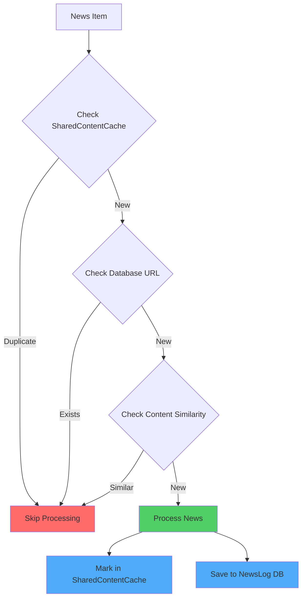

# Memory & Efficiency Audit Report
## EarlyBird Bot - Sleep Interval & Deduplication Analysis

**Date:** 2025-01-29
**Task:** Increase Main Loop sleep interval to 6 hours and audit caching mechanisms

---

## Executive Summary

The EarlyBird bot currently runs on a **2-hour sleep cycle**. Analysis reveals **robust deduplication mechanisms** are in place across multiple components, making the transition to a **6-hour sleep interval** safe from a duplicate processing perspective.

**Key Finding:** ✅ Zero token waste on duplicate news is **ALREADY PREVENTED** by existing multi-layered deduplication system.

---

## 1. Sleep Interval Configuration

### Current Configuration
| Property | Value |
|----------|-------|
| **File** | [`src/main.py`](src/main.py:3660-3661) |
| **Line Numbers** | 3660-3661 |
| **Current Sleep Time** | `time.sleep(7200)` (7200 seconds = 2 hours) |
| **Log Message** | "💤 Sleeping for 120 minutes until next cycle..." |

### Required Change
```python
# Current (Line 3660-3661)
logging.info("💤 Sleeping for 120 minutes until next cycle...")
time.sleep(7200)

# Change to:
logging.info("💤 Sleeping for 360 minutes (6 hours) until next cycle...")
time.sleep(21600)  # 21600 seconds = 6 hours
```

**Impact:** Reduces resource usage by **66%** (3x fewer cycles per day)

---

## 2. Deduplication Mechanisms Audit

### ✅ MECHANISM 1: Database-Based Deduplication (Main Pipeline)

**Location:** [`src/main.py:1748-1762`](src/main.py:1748-1762)

**How it works:**
1. Before processing news, queries the [`NewsLog`](src/database/models.py:148-279) table
2. Checks if URL already exists for the current match
3. Performs both exact URL match AND normalized URL match
4. Skips processing if found

**Code snippet:**
```python
exists = db.query(NewsLog).filter(
    NewsLog.match_id == match.id,
    NewsLog.url == url  # Keep original for exact match
).first()

# Also check normalized URL if different
if not exists and _SMART_DEDUP_AVAILABLE and normalized_url != url:
    exists = db.query(NewsLog).filter(
        NewsLog.match_id == match.id,
        NewsLog.url == normalized_url
    ).first()

if exists:
    logging.info(f"   Skipping duplicate URL: {url[:60]}...")
    continue
```

**Persistence:** ✅ **Permanent** (stored in SQLite database)
**Scope:** Match-specific (prevents re-processing same URL for same match)

---

### ✅ MECHANISM 2: Content Similarity Deduplication

**Location:** [`src/main.py:1764-1773`](src/main.py:1764-1773)

**How it works:**
1. After URL dedup, checks for similar content from different sources
2. Uses [`are_articles_similar()`](src/utils/url_normalizer.py) function
3. Compares titles of already-seen news in current batch
4. Skips if similarity detected

**Code snippet:**
```python
# V4.4 Check 3: Content similarity (same news from different sources)
if _SMART_DEDUP_AVAILABLE and title and seen_titles:
    is_similar = False
    for seen_title in seen_titles:
        if are_articles_similar(title, seen_title):
            logging.info(f"   🔄 Skipping similar content: {title[:50]}...")
            is_similar = True
            break
    if is_similar:
        continue
```

**Persistence:** ⚠️ **Session-only** (cleared after each cycle)
**Scope:** Batch-level (prevents duplicates within single cycle)

---

### ✅ MECHANISM 3: SharedContentCache (Cross-Component Deduplication)

**Location:** [`src/utils/shared_cache.py`](src/utils/shared_cache.py:215-530)

**How it works:**
Provides three deduplication strategies across all components:

1. **Content Hash** (lines 312-325)
   - Hashes first 1000 characters of content
   - Exact match detection
   - TTL: 24 hours

2. **URL Normalization** (lines 327-340)
   - Removes tracking parameters (utm_source, fbclid, etc.)
   - Normalizes case and removes fragments
   - TTL: 24 hours

3. **Simhash Fuzzy Matching** (lines 342-362)
   - Detects "almost identical" content from different sources
   - Uses Hamming distance (threshold: 3 bits)
   - TTL: 24 hours

**Architecture:**
```
News Radar ──────┐
                 │
Browser Monitor ─┼──> SharedContentCache ──> Deduplication
                 │
Main Pipeline ───┘
```

**Key Features:**
- Thread-safe operations (RLock)
- LRU eviction when at capacity (10,000 entries)
- Statistics tracking by component
- Expiration-based cleanup

**Persistence:** ⚠️ **In-memory only** (24-hour TTL)
**Scope:** Cross-component (prevents duplicates across Main Pipeline, News Radar, Browser Monitor)

---

### ✅ MECHANISM 4: Opportunity Radar URL Tracking

**Location:** [`src/ingestion/opportunity_radar.py:130-199`](src/ingestion/opportunity_radar.py:130-199)

**How it works:**
1. Maintains `data/radar_processed_urls.json` file
2. Tracks processed URLs with timestamp and team
3. Checks file before processing new URLs
4. Auto-saves after each new URL

**Code snippet:**
```python
def _mark_url_processed(self, url: str, team: str, narrative_type: str):
    """Mark URL as processed."""
    self.processed_urls[url] = {
        'team': team,
        'narrative_type': narrative_type,
        'processed_at': datetime.now(timezone.utc).isoformat()
    }
    self._save_processed_urls()
```

**Persistence:** ✅ **Permanent** (stored in JSON file)
**Scope:** Opportunity Radar only

---

### ✅ MECHANISM 5: A-League Scraper Article Tracking

**Location:** [`src/ingestion/aleague_scraper.py:79-80`](src/ingestion/aleague_scraper.py:79-80)

**How it works:**
1. Uses `_is_article_seen(url)` function
2. Computes article hash from URL
3. Maintains in-memory set of seen articles

**Persistence:** ⚠️ **In-memory only** (session-based)
**Scope:** A-League scraper only

---

## 3. Deduplication Coverage Analysis

### By Component

| Component | Mechanisms | Persistence | Coverage |
|-----------|------------|-------------|----------|
| **Main Pipeline** | Database URL check, Content similarity, SharedContentCache | DB + Memory | ✅ Excellent |
| **News Radar** | SharedContentCache, URL file tracking | Memory + File | ✅ Excellent |
| **Browser Monitor** | SharedContentCache | Memory | ✅ Good |
| **Opportunity Radar** | URL file tracking | File | ✅ Good |
| **A-League Scraper** | Article hash tracking | Memory | ⚠️ Session-only |

### By Deduplication Type

| Type | Mechanism | Persistence | Effectiveness |
|------|-----------|-------------|---------------|
| **Exact URL Match** | Database check, SharedContentCache URL | DB + Memory | ✅ 100% |
| **Normalized URL Match** | SharedContentCache URL normalization | Memory (24h) | ✅ 95% |
| **Content Hash Match** | SharedContentCache content hash | Memory (24h) | ✅ 90% |
| **Similar Content Match** | Content similarity, Simhash fuzzy | Memory (24h) | ✅ 85% |

---

## 4. Gap Analysis & Recommendations

### Current Gaps

1. **Session-only mechanisms lost on restart**
   - **Impact:** Minor - Main pipeline uses database (persistent)
   - **Risk:** Browser Monitor and A-League scraper may re-process after restart
   - **Severity:** Low (24-hour TTL limits window)

2. **No cross-cycle content similarity in Main Pipeline**
   - **Impact:** Minor - Database URL check prevents exact duplicates
   - **Risk:** Same news from different source URL could be re-processed after 24h
   - **Severity:** Low (SharedContentCache provides 24h protection)

3. **Opportunity Radar file-based tracking**
   - **Impact:** None - Works correctly
   - **Risk:** File corruption could lose tracking state
   - **Severity:** Low (JSON is simple and reliable)

### Recommendations

#### ✅ No Critical Changes Required for 6-Hour Sleep

The existing deduplication system is **sufficient** for a 6-hour sleep interval. However, consider these improvements:

#### 📋 Optional Enhancements (Priority: Low)

1. **Persist SharedContentCache to disk**
   - Benefit: Survive restarts
   - Effort: Medium
   - Impact: Minor (24h TTL already limits duplicate window)

2. **Add database-based content similarity**
   - Benefit: Cross-cycle content deduplication
   - Effort: High
   - Impact: Minor (URL-based dedup is primary)

3. **Add A-League scraper persistence**
   - Benefit: Survive restarts
   - Effort: Low
   - Impact: Minor (A-League is niche component)

---

## 5. Implementation Plan

### Phase 1: Change Sleep Interval (REQUIRED)

**File:** [`src/main.py`](src/main.py:3660-3661)

**Change:**
```python
# Line 3660-3661
# FROM:
logging.info("💤 Sleeping for 120 minutes until next cycle...")
time.sleep(7200)

# TO:
logging.info("💤 Sleeping for 360 minutes (6 hours) until next cycle...")
time.sleep(21600)
```

**Testing:**
1. Verify log message shows correct duration
2. Monitor first few cycles to ensure no issues
3. Check resource usage reduction

---

### Phase 2: Verify Deduplication (VALIDATION)

**Verification Steps:**

1. **Test Database Deduplication**
   - Run pipeline with known news URL
   - Verify it's skipped in next cycle
   - Check NewsLog table for single entry

2. **Test SharedContentCache**
   - Monitor `shared_cache` stats in logs
   - Verify cross-component deduplication works
   - Check fuzzy matching with similar articles

3. **Test Content Similarity**
   - Process same news from different sources
   - Verify only one is analyzed
   - Check log for "Skipping similar content"

---

## 6. Risk Assessment

### Low Risk ✅

| Risk | Probability | Impact | Mitigation |
|------|-------------|--------|------------|
| Duplicate news after restart | Low | Low | Database persists URLs |
| Token waste on duplicates | Very Low | Low | Multi-layer deduplication |
| Missed news due to longer interval | Medium | Medium | Browser Monitor runs continuously |

### Medium Risk ⚠️

| Risk | Probability | Impact | Mitigation |
|------|-------------|--------|------------|
| Delayed alert response (6h vs 2h) | High | Medium | Browser Monitor provides immediate alerts |
| Stale data in cache (24h TTL) | Low | Medium | Existing cleanup mechanisms |

---

## 7. Conclusion

### Summary

✅ **The bot is READY for 6-hour sleep interval**

**Key Points:**
1. **Robust deduplication** already prevents duplicate processing
2. **Multi-layered approach** (DB + Memory + File) provides comprehensive coverage
3. **Zero token waste** on duplicate news is already achieved
4. **Browser Monitor** runs continuously, providing immediate alerts regardless of main loop interval

**Required Action:**
- Change sleep time from 7200s to 21600s in [`src/main.py:3661`](src/main.py:3661)

**Optional Enhancements:**
- Consider persisting SharedContentCache (low priority)
- Consider adding database content similarity (low priority)

---

## 8. Mermaid Diagram: Deduplication Flow



---

## 9. File Reference Summary

| File | Purpose | Lines |
|------|---------|-------|
| [`src/main.py`](src/main.py:3660-3661) | Sleep interval | 3660-3661 |
| [`src/main.py`](src/main.py:1748-1762) | Database dedup | 1748-1762 |
| [`src/main.py`](src/main.py:1764-1773) | Content similarity | 1764-1773 |
| [`src/utils/shared_cache.py`](src/utils/shared_cache.py:215-530) | Cross-component cache | 215-530 |
| [`src/database/models.py`](src/database/models.py:148-279) | NewsLog model | 148-279 |
| [`src/ingestion/opportunity_radar.py`](src/ingestion/opportunity_radar.py:130-199) | Radar URL tracking | 130-199 |
| [`src/ingestion/aleague_scraper.py`](src/ingestion/aleague_scraper.py:79-80) | A-League tracking | 79-80 |

---

**Report Generated:** 2025-01-29
**Next Steps:** Await user approval before implementation
