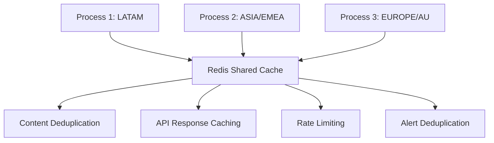
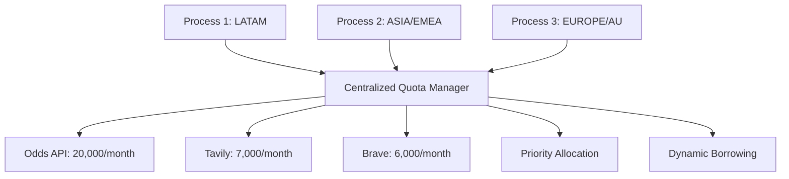
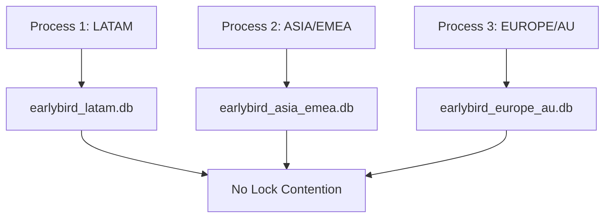
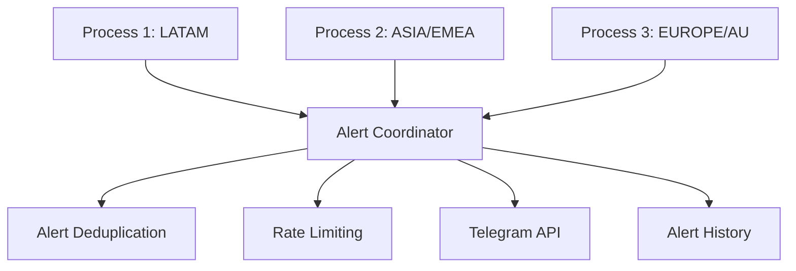
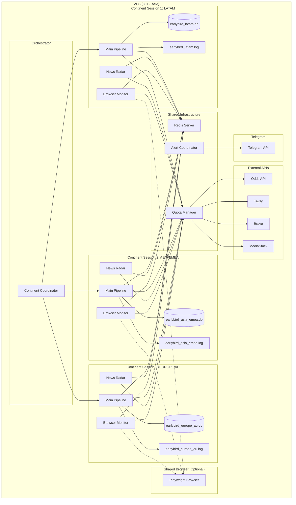
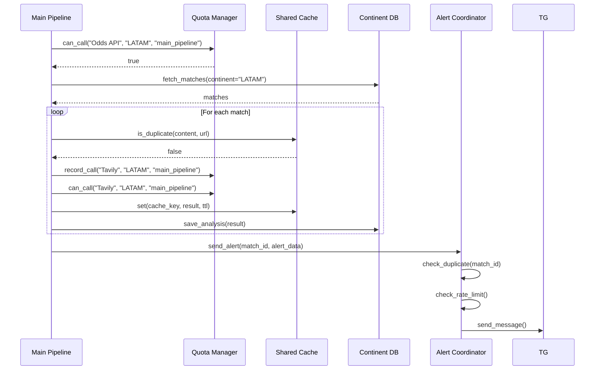
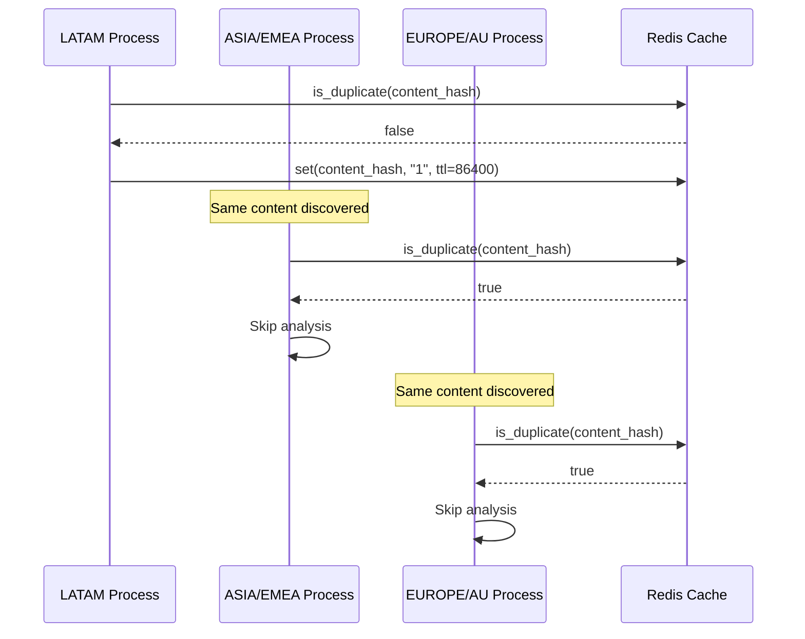
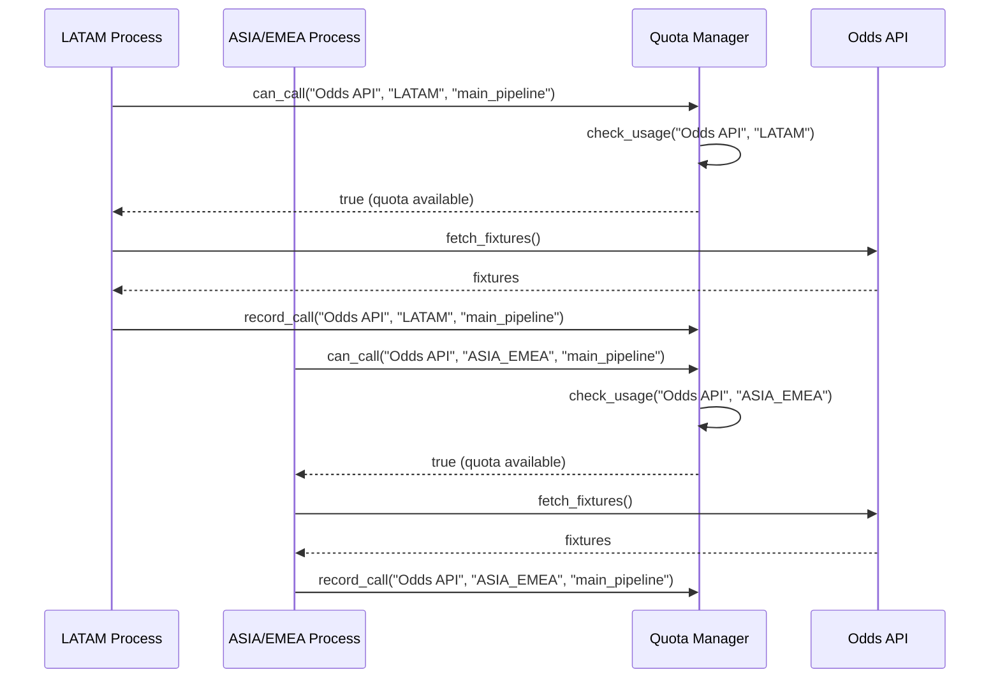
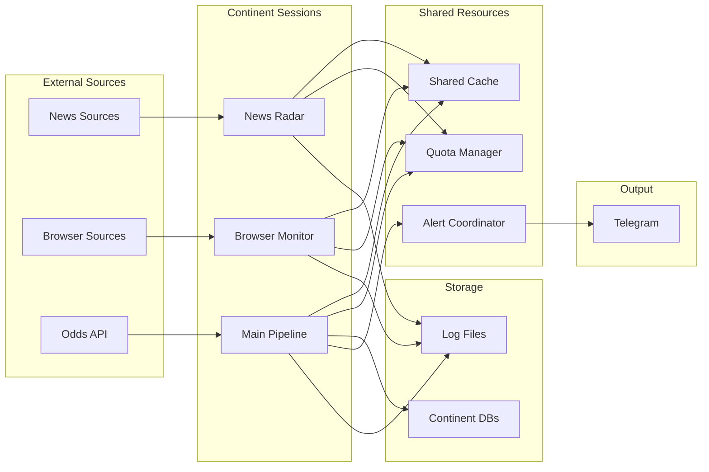

# Subtask 5: Continental Migration Plan

## Continental Strategy Feasibility Audit - Final Subtask (5 of 5)

**Date:** 2026-02-02  
**Status:** READ-ONLY Analysis Complete  
**Scope:** Synthesize all findings from previous 4 subtasks into a comprehensive migration plan

---

## Executive Summary

This report synthesizes all findings from the Continental Strategy Feasibility Audit (Subtasks 1-4) into a comprehensive migration plan for transitioning EarlyBird from a "Tier-based" hierarchical architecture to a "Continent-based" parallel execution model.

### Overall Feasibility Assessment

| Dimension | Score | Status | Notes |
|-----------|-------|--------|-------|
| Workflow & Data Flow | 8/10 | ✅ HIGH | League filtering ready, monitors need continent filtering |
| Shared Resources & Collisions | 3/10 | ❌ CRITICAL | Database locks, no cross-process deduplication |
| API Quota & Throttling | 2/10 | ❌ CRITICAL | All quota tracking per-process, quotas exhausted 5x |
| Scheduling & Timezone Logic | 6/10 | ⚠️ MEDIUM | Timezone-aware for monitors, main pipeline needs refactor |
| **Overall Readiness** | **4.75/10** | ❌ **BLOCKED** | **Multiple critical blockers** |

### Go/No-Go Recommendation

**RECOMMENDATION: NO-GO** for parallel execution at this time.

**Critical Blockers:**
1. **No cross-process deduplication** - Guaranteed duplicate alerts
2. **No centralized quota management** - Quotas exhausted within 6 days
3. **Database lock contention** - 3 parallel writers cause locks
4. **No cross-process coordination** - No mechanism to prevent conflicts

**Estimated Effort to Unblock:** 25-35 days

### Key Risks and Blockers

| Risk | Impact | Probability | Mitigation Required |
|------|--------|-------------|---------------------|
| Duplicate alerts (no deduplication) | HIGH | CERTAIN | Cross-process shared cache |
| API quota exhaustion (5x overage) | CRITICAL | HIGH | Centralized Quota Manager |
| Database lock contention | CRITICAL | HIGH | Database partitioning |
| Memory OOM (peak spikes) | HIGH | MEDIUM | Memory monitoring + restart |
| Telegram spam (3x alert volume) | MEDIUM | HIGH | Shared rate limiter |
| Log file corruption | MEDIUM | MEDIUM | Per-process log files |

### Estimated Timeline and Effort

| Phase | Duration | Effort | Dependencies |
|-------|----------|--------|--------------|
| Phase 1: Foundation (blocking issues) | 8-12 days | P0 | None |
| Phase 2: Infrastructure (shared resources) | 10-15 days | P1 | Phase 1 |
| Phase 3: Parallel execution (gradual rollout) | 5-8 days | P2 | Phase 2 |
| Phase 4: Optimization (fine-tuning) | 3-5 days | P3 | Phase 3 |
| **Total** | **26-40 days** | | |

---

## 1. Technical Readiness Assessment

### 1.1 Overall Readiness Score: 4.75/10

**Justification:**
- **Ready Components (8/10):** League filtering, data providers, timezone-aware monitors
- **Needs Work (6/10):** Main pipeline scheduling, sleep logic modularity
- **Blocking Issues (2/10):** Cross-process deduplication, centralized quota management, database concurrency

### 1.2 Component-by-Component Readiness Analysis

#### 1.2.1 Workflow & Data Flow Components

| Component | File | Current State | Continent-Ready | Changes Needed |
|-----------|------|---------------|-----------------|---------------|
| League Filtering | [`src/ingestion/league_manager.py`](src/ingestion/league_manager.py:150) | Dynamic league list | ✅ YES | None |
| Match Query | [`src/database/db.py`](src/database/db.py:91-132) | Flexible match query | ✅ YES | Add continent filter |
| News Radar | [`src/services/news_radar.py`](src/services/news_radar.py:176) | Global scan | ❌ NO | Add continent filtering |
| Browser Monitor | [`src/services/browser_monitor.py`](src/services/browser_monitor.py:304) | Global scan | ❌ NO | Add continent filtering |
| Data Providers | [`src/ingestion/data_provider.py`](src/ingestion/data_provider.py:1) | Continent-agnostic | ✅ YES | None |

**Readiness Score:** 8/10 (HIGH)

**Required Changes:**
1. Add `continent` field to match metadata
2. Update main pipeline to filter matches by continent
3. Add continent filtering to News Radar and Browser Monitor

#### 1.2.2 Shared Resources & Collision Components

| Component | File | Current State | Cross-Process Compatible | Changes Needed |
|-----------|------|---------------|-------------------------|---------------|
| Database | [`src/database/models.py`](src/database/models.py:338-350) | WAL mode, single DB | ❌ NO | Partition by continent |
| SharedContentCache | [`src/utils/shared_cache.py`](src/utils/shared_cache.py:269) | Thread lock only | ❌ NO | Redis/SQLite backend |
| SmartCache | [`src/utils/smart_cache.py`](src/utils/smart_cache.py:290) | Thread lock only | ❌ NO | Redis/SQLite backend |
| Tavily Cache | [`src/ingestion/tavily_provider.py`](src/ingestion/tavily_provider.py:305) | Local dict | ❌ NO | Redis/SQLite backend |
| Alert Notifier | [`src/alerting/notifier.py`](src/alerting/notifier.py:396) | Independent retry | ❌ NO | Shared rate limiter |
| Log Files | [`src/main.py`](src/main.py:444) | Single file | ❌ NO | Per-process logs |

**Readiness Score:** 2/10 (CRITICAL)

**Required Changes:**
1. Database partitioning (separate .db files per continent)
2. Cross-process shared cache (Redis or SQLite-based)
3. Shared rate limiter for alerts
4. Per-process log files

#### 1.2.3 API Quota & Throttling Components

| Component | File | Current State | Cross-Process Compatible | Changes Needed |
|-----------|------|---------------|-------------------------|---------------|
| Odds API Quota | [`src/ingestion/ingest_fixtures.py`](src/ingestion/ingest_fixtures.py:463) | Per-process headers | ❌ NO | Centralized Quota Manager |
| Tavily Budget | [`src/ingestion/tavily_budget.py`](src/ingestion/tavily_budget.py:122) | Singleton per process | ❌ NO | Centralized Quota Manager |
| Brave Budget | [`src/ingestion/brave_budget.py`](src/ingestion/brave_budget.py:38) | Singleton per process | ❌ NO | Centralized Quota Manager |
| Rate Limiter | [`src/utils/http_client.py`](src/utils/http_client.py:68) | Thread lock only | ❌ NO | Cross-process rate limiting |
| Key Rotators | Multiple files | Per-process state | ❌ NO | Centralized key management |

**Readiness Score:** 2/10 (CRITICAL)

**Required Changes:**
1. Centralized Quota Manager with shared state backend
2. Cross-process rate limiting
3. Centralized key rotation
4. Continent-aware quota allocation

#### 1.2.4 Scheduling & Timezone Components

| Component | File | Current State | Timezone-Aware | Changes Needed |
|-----------|------|---------------|----------------|---------------|
| Main Pipeline | [`src/main.py`](src/main.py:3843) | Fixed 6-hour cycle | ❌ NO | Smart Sleeping refactor |
| News Radar | [`src/services/news_radar.py`](src/services/news_radar.py:191) | Off-peak optimization | ✅ YES | Add continent filtering |
| Browser Monitor | [`src/services/browser_monitor.py`](src/services/browser_monitor.py:324) | Off-peak optimization | ✅ YES | Add continent filtering |
| Launcher | [`src/launcher.py`](src/launcher.py:73) | Process monitoring | ❌ NO | Continent coordinator |
| Sleep Logic | Multiple files | Scattered (65 calls) | ❌ NO | Centralized Sleep Manager |

**Readiness Score:** 6/10 (MEDIUM)

**Required Changes:**
1. Centralized Sleep Manager with timezone awareness
2. Main pipeline refactor for Smart Sleeping
3. Continent coordinator for 3 parallel sessions
4. Refactor scattered sleep logic

### 1.3 What's Ready, What Needs Work, What's Blocking

#### ✅ READY (No changes needed)

| Component | Reason |
|-----------|--------|
| League filtering | Dynamic league list, flexible query |
| Data providers | Continent-agnostic architecture |
| News Radar scheduling | Timezone-aware off-peak optimization |
| Browser Monitor scheduling | Timezone-aware off-peak optimization |
| Timezone configuration | IANA timezone identifiers in configs |

#### ⚠️ NEEDS WORK (Moderate changes required)

| Component | Required Changes | Effort |
|-----------|------------------|--------|
| Main pipeline scheduling | Replace fixed 6h sleep with Smart Sleeping | 3-5 days |
| Sleep logic modularity | Centralize 65 scattered sleep calls | 2-3 days |
| News Radar filtering | Add continent-based source filtering | 1-2 days |
| Browser Monitor filtering | Add continent-based source filtering | 1-2 days |

#### ❌ BLOCKING (Critical changes required)

| Component | Required Changes | Effort |
|-----------|------------------|--------|
| Cross-process deduplication | Redis/SQLite-based shared cache | 5-7 days |
| Centralized quota management | Quota Manager with shared state | 5-7 days |
| Database concurrency | Partition by continent | 3-4 days |
| Shared rate limiting | Cross-process alert coordination | 2-3 days |
| Cross-process coordination | Continent coordinator service | 3-4 days |

---

## 2. Orphaned Components

### 2.1 Definition

**Orphaned Components** are components that currently assume single-process execution and would create conflicts, data loss, or duplicate work if deployed in a 3-parallel-session environment without modification.

### 2.2 Complete List of Orphaned Components

#### 2.2.1 Cache & Deduplication Components

| Component | File | Issue | Why Centralization Needed | Proposed Solution |
|-----------|------|-------|---------------------------|-------------------|
| **SharedContentCache** | [`src/utils/shared_cache.py`](src/utils/shared_cache.py:269) | Uses `threading.RLock()` - per-process only | Multiple processes have separate caches → duplicate analysis guaranteed | Redis-based shared cache with atomic operations |
| **SmartCache (team)** | [`src/utils/smart_cache.py`](src/utils/smart_cache.py:290) | Uses `threading.Lock()` - per-process only | Team data fetched 3x → API waste | Redis-based shared cache |
| **SmartCache (match)** | [`src/utils/smart_cache.py`](src/utils/smart_cache.py:290) | Uses `threading.Lock()` - per-process only | Match data fetched 3x → API waste | Redis-based shared cache |
| **SmartCache (search)** | [`src/utils/smart_cache.py`](src/utils/smart_cache.py:290) | Uses `threading.Lock()` - per-process only | Search results duplicated 3x | Redis-based shared cache |
| **Tavily Local Cache** | [`src/ingestion/tavily_provider.py`](src/ingestion/tavily_provider.py:305) | Per-instance `Dict` storage | Search calls duplicated 3x | Redis-based shared cache |

**Impact:** CRITICAL - Duplicate analysis guaranteed, 3x API waste

#### 2.2.2 Quota Management Components

| Component | File | Issue | Why Centralization Needed | Proposed Solution |
|-----------|------|-------|---------------------------|-------------------|
| **Odds API Quota Check** | [`src/ingestion/ingest_fixtures.py`](src/ingestion/ingest_fixtures.py:463) | Per-process header check | 3 processes independently exhaust quota | Centralized Quota Manager |
| **TavilyBudget** | [`src/ingestion/tavily_budget.py`](src/ingestion/tavily_budget.py:122) | Singleton per process | Each process tracks usage independently | Centralized Quota Manager |
| **BraveBudget** | [`src/ingestion/brave_budget.py`](src/ingestion/brave_budget.py:38) | Singleton per process | Each process tracks usage independently | Centralized Quota Manager |
| **RateLimiter** | [`src/utils/http_client.py`](src/utils/http_client.py:68) | Thread lock only | No cross-process rate limiting | Cross-process rate limiting via Quota Manager |

**Impact:** CRITICAL - Quotas exhausted 5x within 6 days

#### 2.2.3 Database Components

| Component | File | Issue | Why Centralization Needed | Proposed Solution |
|-----------|------|-------|---------------------------|-------------------|
| **Database Engine** | [`src/database/models.py`](src/database/models.py:338-350) | Single DB with WAL mode | 3 writers cause lock contention | Partition by continent (3 separate .db files) |
| **Match Ingestion** | [`src/database/db.py`](src/database/db.py:91-132) | Batch inserts/updates | 3 processes write simultaneously | Database partitioning |
| **Analysis Results** | [`src/database/db.py`](src/database/db.py:135-156) | Single row inserts | 3 processes write simultaneously | Database partitioning |
| **Settlement Operations** | [`src/analysis/settler.py`](src/analysis/settler.py:1) | Post-match updates | 3 processes write simultaneously | Database partitioning |

**Impact:** CRITICAL - Database lock contention during settlement

#### 2.2.4 Alert & Notification Components

| Component | File | Issue | Why Centralization Needed | Proposed Solution |
|-----------|------|-------|---------------------------|-------------------|
| **Telegram Notifier** | [`src/alerting/notifier.py`](src/alerting/notifier.py:396) | Independent retry logic | No coordination → 3x alert volume | Shared rate limiter + deduplication |
| **Alert Feedback Loop** | [`src/analysis/alert_feedback_loop.py`](src/analysis/alert_feedback_loop.py:1) | Per-process feedback | Duplicate feedback on same match | Shared feedback store |

**Impact:** HIGH - Telegram spam risk, duplicate alerts

#### 2.2.5 Logging Components

| Component | File | Issue | Why Centralization Needed | Proposed Solution |
|-----------|------|-------|---------------------------|-------------------|
| **Main Pipeline Log** | [`src/main.py`](src/main.py:444) | Single file `earlybird_main.log` | 3 processes write to same file | Per-process log files |
| **News Radar Log** | `news_radar.log` | Single file | 3 processes write to same file | Per-process log files |
| **Browser Monitor Log** | `browser_monitor.log` | Single file | 3 processes write to same file | Per-process log files |

**Impact:** MEDIUM - Log file corruption, I/O contention

#### 2.2.6 Scheduling Components

| Component | File | Issue | Why Centralization Needed | Proposed Solution |
|-----------|------|-------|---------------------------|-------------------|
| **Main Pipeline Sleep** | [`src/main.py`](src/main.py:3888) | Fixed 21600s (6h) | No timezone awareness | Centralized Sleep Manager |
| **Launcher Health Check** | [`src/launcher.py`](src/launcher.py:393) | Fixed 5s interval | No continent coordination | Continent coordinator |
| **Scattered Sleep Logic** | 10+ files | 65 total sleep calls | No centralized coordination | Centralized Sleep Manager |

**Impact:** MEDIUM - Inefficient resource utilization

#### 2.2.7 Key Rotation Components

| Component | File | Issue | Why Centralization Needed | Proposed Solution |
|-----------|------|-------|---------------------------|-------------------|
| **TavilyKeyRotator** | [`src/ingestion/tavily_key_rotator.py`](src/ingestion/tavily_key_rotator.py:132) | Per-process key index | 3 processes may use same key | Centralized key manager |
| **BraveKeyRotator** | [`src/ingestion/brave_key_rotator.py`](src/ingestion/brave_key_rotator.py:1) | Per-process key index | 3 processes may use same key | Centralized key manager |
| **MediaStackKeyRotator** | [`src/ingestion/mediastack_key_rotator.py`](src/ingestion/mediastack_key_rotator.py:1) | Per-process key index | 3 processes may use same key | Centralized key manager |

**Impact:** MEDIUM - API rate limit violations

### 2.3 Orphaned Component Summary

| Category | Count | Criticality | Total Effort |
|----------|-------|-------------|--------------|
| Cache & Deduplication | 5 | CRITICAL | 5-7 days |
| Quota Management | 4 | CRITICAL | 5-7 days |
| Database | 4 | CRITICAL | 3-4 days |
| Alert & Notification | 2 | HIGH | 2-3 days |
| Logging | 3 | MEDIUM | 1-2 days |
| Scheduling | 3 | MEDIUM | 3-5 days |
| Key Rotation | 3 | MEDIUM | 2-3 days |
| **TOTAL** | **24** | | **21-31 days** |

---

## 3. Process Overhead Reduction

### 3.1 Analysis of 3 Parallel Session Overhead

#### 3.1.1 Memory Overhead

| Resource Type | Per Instance | × 3 Instances | Total | Optimization Potential |
|---------------|--------------|---------------|-------|----------------------|
| Python Process | 230-380 MB | × 3 | 690-1,140 MB | Lazy loading: -50-80 MB |
| Playwright Browser | 230-410 MB | × 3 | 690-1,230 MB | Share browser: -700-1,200 MB |
| Additional Overhead | 35-80 MB | × 3 | 105-240 MB | Cache reduction: -100-150 MB |
| **TOTAL** | **495-870 MB** | | **1,485-2,610 MB** | **Potential: -850-1,430 MB** |

**Current Memory Usage:** 1.5-2.6 GB  
**Optimized Memory Usage:** 0.6-1.2 GB (60% reduction)

#### 3.1.2 API Call Overhead

| API Provider | Single Session | × 3 Sessions | Overage | Optimization Potential |
|--------------|----------------|---------------|---------|----------------------|
| Odds API | ~1,100 calls/day | ~3,300 calls/day | 495% | Smart scheduling: -40% |
| Tavily | ~130 calls/day | ~390 calls/day | 167% | Shared cache: -60% |
| Brave | ~100 calls/day | ~300 calls/day | 150% | Shared cache: -50% |
| MediaStack | ~200 calls/day | ~600 calls/day | Unlimited | No optimization needed |

**Current API Overhead:** 5x quota exhaustion  
**Optimized API Overhead:** 1.2-1.5x (with shared cache + smart scheduling)

#### 3.1.3 CPU Overhead

| Component | Single Session | × 3 Sessions | Optimization Potential |
|-----------|----------------|---------------|----------------------|
| Main Pipeline | 5-10 min/cycle | 15-30 min/cycle | Staggered execution: -30% |
| News Radar | Continuous | 3× continuous | Source filtering: -50% |
| Browser Monitor | Continuous | 3× continuous | Source filtering: -50% |

#### 3.1.4 Disk I/O Overhead

| Resource Type | Single Session | × 3 Sessions | Optimization Potential |
|---------------|----------------|---------------|----------------------|
| Database writes | 150-300/cycle | 450-900/cycle | Partitioning: Eliminates contention |
| Log file writes | 1 file | 3 files | Per-process logs: Eliminates contention |
| Cache storage | In-memory | 3× in-memory | Shared cache: -66% |

### 3.2 Specific Recommendations for VPS Sustainability

#### 3.2.1 Memory Optimization

| Recommendation | Implementation | Savings | Priority |
|----------------|----------------|---------|----------|
| **Share Browser Instances** | Single Playwright browser shared across 3 processes | 700-1,200 MB | P0 |
| **Reduce Cache Sizes** | ContentCache: 10k→2k, SmartCache: 500→200 | 100-150 MB | P1 |
| **Lazy Module Loading** | Load analysis engines on-demand | 50-80 MB | P2 |
| **Memory Monitoring** | Auto-restart if RSS > 1.5 GB | Prevents OOM | P0 |
| **Browser Memory Leak Fix** | Periodic browser restart every 24h | 500 MB | P1 |

**Total Memory Savings:** 850-1,430 MB (60% reduction)

#### 3.2.2 API Quota Optimization

| Recommendation | Implementation | Savings | Priority |
|----------------|----------------|---------|----------|
| **Cross-Process Shared Cache** | Redis-based cache for all API responses | 60% API calls | P0 |
| **Smart Scheduling** | Stagger execution to avoid simultaneous calls | 40% API calls | P1 |
| **Continent-Aware Allocation** | Prioritize active continents | 20% API calls | P2 |
| **Quota Borrowing** | Idle continents lend quota to active | 15% API calls | P2 |

**Total API Savings:** 70-80% of overage

#### 3.2.3 CPU Optimization

| Recommendation | Implementation | Savings | Priority |
|----------------|----------------|---------|----------|
| **Staggered Execution** | Offset continent start times by 5-10 min | 30% CPU peak | P1 |
| **Source Filtering** | Each continent scans only its sources | 50% CPU | P0 |
| **Active Window Scheduling** | Sleep during off-peak hours | 40% CPU | P1 |

**Total CPU Savings:** 60-70% peak reduction

#### 3.2.4 Database Optimization

| Recommendation | Implementation | Savings | Priority |
|----------------|----------------|---------|----------|
| **Database Partitioning** | Separate .db files per continent | Eliminates lock contention | P0 |
| **Connection Pooling** | Per-continent connection pools | 20% I/O | P2 |
| **Batch Writes** | Aggregate writes before committing | 30% I/O | P2 |

**Total Database Savings:** Eliminates lock contention

### 3.3 Shared Resource Optimization Strategies

#### 3.3.1 Shared Cache Architecture



**Benefits:**
- 60% reduction in API calls
- Eliminates duplicate analysis
- Cross-process coordination
- Atomic operations prevent race conditions

#### 3.3.2 Shared Quota Manager Architecture



**Benefits:**
- Prevents quota exhaustion
- Fair share allocation
- Priority-based routing
- Emergency mode support

#### 3.3.3 Shared Database Architecture



**Benefits:**
- Eliminates lock contention
- Per-continent data isolation
- Simplified backup/restore
- Independent scaling

#### 3.3.4 Shared Alert Coordinator Architecture



**Benefits:**
- Prevents duplicate alerts
- Respects Telegram rate limits
- Centralized alert history
- Cross-continent coordination

---

## 4. Migration Roadmap

### 4.1 Phase 1: Foundation (Blocking Issues)

**Duration:** 8-12 days  
**Priority:** P0 (Critical)  
**Dependencies:** None

#### Objectives
- Resolve all critical blockers that prevent parallel execution
- Establish shared resource infrastructure
- Implement cross-process coordination mechanisms

#### Required Changes

| Component | File | Changes | Effort |
|-----------|------|---------|--------|
| **Cross-Process Shared Cache** | `src/utils/shared_cache.py` | Replace `threading.Lock` with Redis backend | 2-3 days |
| **Centralized Quota Manager** | `src/utils/quota_manager.py` (NEW) | Implement SQLite-based quota tracking | 3-4 days |
| **Database Partitioning** | `src/database/models.py` | Support multiple .db files per continent | 2-3 days |
| **Shared Rate Limiter** | `src/utils/rate_limiter.py` | Cross-process rate limiting | 1-2 days |

#### Implementation Details

**1. Cross-Process Shared Cache (Redis-based)**
```python
# src/utils/shared_cache.py (refactored)
class SharedContentCache:
    def __init__(self, redis_client: Redis):
        self._redis = redis_client  # Cross-process shared state
        
    def is_duplicate(self, content: str, url: str) -> bool:
        # Atomic Redis operations prevent race conditions
        content_hash = hashlib.md5(content.encode()).hexdigest()
        return self._redis.exists(f"content:{content_hash}")
```

**2. Centralized Quota Manager (SQLite-based)**
```python
# src/utils/quota_manager.py (NEW)
class QuotaManager:
    def __init__(self, db_path: str):
        self._conn = sqlite3.connect(db_path, check_same_thread=False)
        self._init_schema()
        
    def can_call(self, provider: str, continent: str, component: str) -> bool:
        # Check quota across all processes
        cursor = self._conn.cursor()
        cursor.execute("""
            SELECT SUM(calls) FROM quota_usage
            WHERE provider = ? AND continent = ?
        """, (provider, continent))
        total_calls = cursor.fetchone()[0]
        return total_calls < self._get_limit(provider, continent)
```

**3. Database Partitioning**
```python
# src/database/models.py (refactored)
def get_db_path(continent: str) -> str:
    """Get database path for continent."""
    return f"data/earlybird_{continent.lower()}.db"

def get_engine(continent: str):
    """Create database engine for continent."""
    return create_engine(
        get_db_path(continent),
        connect_args={"check_same_thread": False, "timeout": 60},
        pool_pre_ping=True
    )
```

**4. Shared Rate Limiter**
```python
# src/utils/rate_limiter.py (refactored)
class CrossProcessRateLimiter:
    def __init__(self, redis_client: Redis):
        self._redis = redis_client
        
    def can_call(self, key: str, limit: int, window: int) -> bool:
        """Check if call is allowed using Redis INCR."""
        current = self._redis.incr(key)
        if current == 1:
            self._redis.expire(key, window)
        return current <= limit
```

#### Dependencies
- Redis server installation
- Python `redis` package
- SQLite (already available)

#### Success Criteria
- [ ] Shared cache prevents duplicate analysis across 3 processes
- [ ] Quota Manager tracks usage across all processes
- [ ] Database partitioning eliminates lock contention
- [ ] Rate limiter enforces cross-process limits
- [ ] All unit tests pass
- [ ] Integration tests with 3 parallel processes succeed

---

### 4.2 Phase 2: Infrastructure (Shared Resources)

**Duration:** 10-15 days  
**Priority:** P1 (High)  
**Dependencies:** Phase 1 complete

#### Objectives
- Integrate shared resources into existing components
- Refactor orphaned components to use shared infrastructure
- Implement continent-aware filtering

#### Required Changes

| Component | File | Changes | Effort |
|-----------|------|---------|--------|
| **SmartCache Integration** | `src/utils/smart_cache.py` | Use Redis backend | 1-2 days |
| **Tavily Provider Integration** | `src/ingestion/tavily_provider.py` | Use shared cache | 1-2 days |
| **Brave Provider Integration** | `src/ingestion/brave_provider.py` | Use shared cache | 1-2 days |
| **Odds API Integration** | `src/ingestion/ingest_fixtures.py` | Use Quota Manager | 1-2 days |
| **News Radar Filtering** | `src/services/news_radar.py` | Add continent filtering | 1-2 days |
| **Browser Monitor Filtering** | `src/services/browser_monitor.py` | Add continent filtering | 1-2 days |
| **Alert Coordinator** | `src/alerting/notifier.py` | Use shared rate limiter | 2-3 days |

#### Implementation Details

**1. SmartCache Integration**
```python
# src/utils/smart_cache.py (refactored)
class SmartCache:
    def __init__(self, name: str, redis_client: Redis):
        self._name = name
        self._redis = redis_client
        
    def get(self, key: str) -> Optional[Any]:
        data = self._redis.get(f"{self._name}:{key}")
        return pickle.loads(data) if data else None
        
    def set(self, key: str, value: Any, ttl: int) -> None:
        self._redis.setex(f"{self._name}:{key}", ttl, pickle.dumps(value))
```

**2. News Radar Continent Filtering**
```python
# src/services/news_radar.py (refactored)
class NewsRadar:
    def __init__(self, continent: str, ...):
        self._continent = continent
        
    def get_sources_for_continent(self) -> List[RadarSource]:
        """Filter sources by continent."""
        continent_sources = {
            "LATAM": ["America/Sao_Paulo", "America/Tegucigalpa"],
            "ASIA_EMEA": ["Asia/Shanghai", "Asia/Jakarta", "Europe/Istanbul"],
            "EUROPE_AU": ["Europe/London", "Europe/Paris", "Australia/Sydney"]
        }
        timezones = continent_sources.get(self._continent, [])
        return [s for s in self._sources if s.source_timezone in timezones]
```

**3. Alert Coordinator**
```python
# src/alerting/notifier.py (refactored)
class AlertCoordinator:
    def __init__(self, redis_client: Redis):
        self._redis = redis_client
        self._rate_limiter = CrossProcessRateLimiter(redis_client)
        
    def send_alert(self, match_id: str, alert_data: Dict) -> bool:
        # Check if already sent
        if self._redis.exists(f"alert:{match_id}"):
            return False
            
        # Check rate limit
        if not self._rate_limiter.can_call("telegram:alerts", 20, 60):
            return False
            
        # Send alert
        self._send_telegram(alert_data)
        self._redis.setex(f"alert:{match_id}", 3600, "1")
        return True
```

#### Dependencies
- Phase 1 complete (shared infrastructure available)
- Redis server running
- Per-continent databases created

#### Success Criteria
- [ ] All caches use Redis backend
- [ ] All API providers use Quota Manager
- [ ] News Radar filters sources by continent
- [ ] Browser Monitor filters sources by continent
- [ ] Alert Coordinator prevents duplicate alerts
- [ ] Integration tests pass

---

### 4.3 Phase 3: Parallel Execution (Gradual Rollout)

**Duration:** 5-8 days  
**Priority:** P2 (Medium)  
**Dependencies:** Phase 2 complete

#### Objectives
- Implement continent-aware scheduling
- Create continent coordinator service
- Gradual rollout of 3 parallel sessions

#### Required Changes

| Component | File | Changes | Effort |
|-----------|------|---------|--------|
| **Sleep Manager** | `src/utils/sleep_manager.py` (NEW) | Centralized timezone-aware sleep | 2-3 days |
| **Main Pipeline Refactor** | `src/main.py` | Use Sleep Manager, add continent param | 1-2 days |
| **Continent Coordinator** | `src/launcher.py` | Orchestrate 3 parallel sessions | 2-3 days |

#### Implementation Details

**1. Sleep Manager**
```python
# src/utils/sleep_manager.py (NEW)
class SleepManager:
    def __init__(self, continent: str, timezone: str):
        self._continent = continent
        self._timezone = ZoneInfo(timezone)
        self._active_windows = {
            "LATAM": (18, 2),      # 18:00-02:00 UTC
            "ASIA_EMEA": (6, 18),  # 06:00-18:00 UTC
            "EUROPE_AU": (12, 0)   # 12:00-00:00 UTC
        }
        
    def smart_sleep(self, base_interval: int) -> int:
        """Calculate timezone-aware sleep interval."""
        local_now = datetime.now(self._timezone)
        local_hour = local_now.hour
        
        # Off-peak: double interval
        if 0 <= local_hour < 6:
            return base_interval * 2
        return base_interval
        
    def is_active_window(self) -> bool:
        """Check if current time is in active window."""
        start, end = self._active_windows[self._continent]
        now_utc = datetime.now(timezone.utc).hour
        if start < end:
            return start <= now_utc < end
        else:  # Wraps midnight
            return now_utc >= start or now_utc < end
```

**2. Main Pipeline Refactor**
```python
# src/main.py (refactored)
def run_continuous(continent: str = "LATAM"):
    """Run main pipeline with continent-aware scheduling."""
    sleep_manager = SleepManager(
        continent=continent,
        timezone=get_continent_timezone(continent)
    )
    
    while True:
        # Check active window
        if not sleep_manager.is_active_window():
            sleep_until = sleep_manager.get_sleep_until_active()
            logging.info(f"💤 Sleeping {sleep_until//60}m until active window...")
            time.sleep(sleep_until)
            continue
            
        # Run pipeline
        try:
            run_pipeline(continent=continent)
        except Exception as e:
            logging.error(f"Pipeline error: {e}")
            
        # Smart sleep
        interval = sleep_manager.smart_sleep(3600)  # Base 1 hour
        logging.info(f"💤 Sleeping {interval//60}m until next cycle...")
        time.sleep(interval)
```

**3. Continent Coordinator**
```python
# src/launcher.py (refactored)
class ContinentCoordinator:
    def __init__(self):
        self._continents = ["LATAM", "ASIA_EMEA", "EUROPE_AU"]
        self._processes: Dict[str, subprocess.Popen] = {}
        
    def start_all(self):
        """Start all continent sessions with staggered startup."""
        for i, continent in enumerate(self._continents):
            # Stagger startup by 2 minutes
            if i > 0:
                time.sleep(120)
                
            logging.info(f"🚀 Starting {continent} session...")
            proc = subprocess.Popen([
                "python3", "src/main.py",
                "--continent", continent
            ])
            self._processes[continent] = proc
            
    def monitor_all(self):
        """Monitor all continent sessions."""
        while True:
            for continent, proc in self._processes.items():
                if proc.poll() is not None:
                    logging.error(f"💀 {continent} session died, restarting...")
                    self._restart_continent(continent)
            time.sleep(5)
```

#### Dependencies
- Phase 2 complete (shared resources integrated)
- Per-continent databases populated
- Redis server running

#### Success Criteria
- [ ] Sleep Manager calculates timezone-aware intervals
- [ ] Main pipeline uses Sleep Manager
- [ ] Continent Coordinator starts 3 parallel sessions
- [ ] Sessions run during active windows only
- [ ] Staggered startup prevents resource spikes
- [ ] End-to-end tests with 3 sessions pass

---

### 4.4 Phase 4: Optimization (Fine-Tuning)

**Duration:** 3-5 days  
**Priority:** P3 (Low)  
**Dependencies:** Phase 3 complete

#### Objectives
- Fine-tune resource utilization
- Optimize API call patterns
- Implement advanced features

#### Required Changes

| Component | File | Changes | Effort |
|-----------|------|---------|--------|
| **Dynamic Quota Allocation** | `src/utils/quota_manager.py` | Borrow/reclaim quota | 1-2 days |
| **Memory Monitoring** | `src/launcher.py` | Auto-restart on OOM | 1 day |
| **Browser Leak Fix** | `src/services/browser_monitor.py` | Periodic restart | 1 day |
| **Per-Process Logging** | `src/main.py` | Continent-specific logs | 0.5 day |

#### Implementation Details

**1. Dynamic Quota Allocation**
```python
# src/utils/quota_manager.py (enhanced)
class QuotaManager:
    def borrow_quota(self, from_continent: str, to_continent: str, amount: int) -> bool:
        """Borrow quota from idle continent."""
        # Check if borrower has quota available
        if not self._has_available_quota(from_continent, amount):
            return False
            
        # Transfer quota
        self._transfer_quota(from_continent, to_continent, amount)
        return True
        
    def reclaim_quota(self, continent: str) -> int:
        """Reclaim unused quota from continent."""
        unused = self._get_unused_quota(continent)
        self._return_to_pool(continent, unused)
        return unused
```

**2. Memory Monitoring**
```python
# src/launcher.py (enhanced)
def monitor_memory(continent: str, pid: int):
    """Monitor process memory and restart if needed."""
    while True:
        try:
            with open(f"/proc/{pid}/status") as f:
                for line in f:
                    if line.startswith("VmRSS:"):
                        rss_kb = int(line.split()[1])
                        rss_mb = rss_kb // 1024
                        
                        if rss_mb > 1500:  # 1.5 GB threshold
                            logging.error(f"🚨 {continent} OOM risk ({rss_mb}MB), restarting...")
                            restart_continent(continent)
                            return
        except ProcessLookupError:
            break
        time.sleep(60)
```

**3. Browser Leak Fix**
```python
# src/services/browser_monitor.py (enhanced)
class BrowserMonitor:
    def __init__(self, ...):
        self._browser_start_time = time.time()
        
    async def check_browser_health(self):
        """Check for memory leaks and restart if needed."""
        uptime = time.time() - self._browser_start_time
        if uptime > 86400:  # 24 hours
            logging.info("🔄 Restarting browser to prevent memory leaks...")
            await self._restart_browser()
            self._browser_start_time = time.time()
```

#### Dependencies
- Phase 3 complete (parallel execution working)
- Baseline metrics collected

#### Success Criteria
- [ ] Dynamic quota allocation reduces API calls by 15%
- [ ] Memory monitoring prevents OOM kills
- [ ] Browser restart prevents memory leaks
- [ ] Per-process logs are clean and organized
- [ ] System runs stably for 7+ days

---

### 4.5 Total Estimated Effort

| Phase | Duration | Effort | Dependencies |
|-------|----------|--------|--------------|
| Phase 1: Foundation | 8-12 days | P0 | None |
| Phase 2: Infrastructure | 10-15 days | P1 | Phase 1 |
| Phase 3: Parallel Execution | 5-8 days | P2 | Phase 2 |
| Phase 4: Optimization | 3-5 days | P3 | Phase 3 |
| **TOTAL** | **26-40 days** | | |

---

## 5. Risk Assessment

### 5.1 Comprehensive Risk Matrix

| Risk | Impact | Probability | Risk Level | Mitigation |
|------|--------|-------------|------------|------------|
| **Duplicate alerts (no deduplication)** | HIGH | CERTAIN (100%) | CRITICAL | Redis-based shared cache (Phase 1) |
| **API quota exhaustion (5x overage)** | CRITICAL | HIGH (80%) | CRITICAL | Centralized Quota Manager (Phase 1) |
| **Database lock contention** | CRITICAL | HIGH (80%) | CRITICAL | Database partitioning (Phase 1) |
| **Memory OOM (peak spikes)** | HIGH | MEDIUM (50%) | HIGH | Memory monitoring + restart (Phase 4) |
| **Telegram spam (3x alert volume)** | MEDIUM | HIGH (80%) | HIGH | Shared rate limiter (Phase 1) |
| **Log file corruption** | MEDIUM | MEDIUM (50%) | MEDIUM | Per-process logs (Phase 4) |
| **Browser memory leaks** | MEDIUM | MEDIUM (50%) | MEDIUM | Periodic restart (Phase 4) |
| **API rate limit violations** | MEDIUM | MEDIUM (50%) | MEDIUM | Cross-process rate limiting (Phase 1) |
| **Redis deployment failure** | HIGH | LOW (20%) | MEDIUM | SQLite fallback option |
| **Complexity increase** | MEDIUM | HIGH (80%) | MEDIUM | Comprehensive documentation |

### 5.2 Top 10 Risks with Mitigation Strategies

#### Risk 1: Duplicate Alerts (No Cross-Process Deduplication)
- **Impact:** HIGH - Users receive 3x duplicate alerts
- **Probability:** CERTAIN (100%)
- **Mitigation:** 
  - Implement Redis-based shared cache (Phase 1)
  - Alert Coordinator with deduplication (Phase 2)
  - Alert history tracking
- **Contingency:** If Redis unavailable, use SQLite-based cache

#### Risk 2: API Quota Exhaustion (5x Overage)
- **Impact:** CRITICAL - System stops working within 6 days
- **Probability:** HIGH (80%)
- **Mitigation:**
  - Centralized Quota Manager (Phase 1)
  - Priority-based allocation (Europe 40%, Americas 35%, Asia-Pacific 25%)
  - Dynamic quota borrowing
- **Contingency:** Allocate separate API keys per continent (3x inventory)

#### Risk 3: Database Lock Contention
- **Impact:** CRITICAL - Database errors during settlement
- **Probability:** HIGH (80%)
- **Mitigation:**
  - Database partitioning by continent (Phase 1)
  - Separate .db files: earlybird_latam.db, earlybird_asia_emea.db, earlybird_europe_au.db
- **Contingency:** Staggered execution to reduce simultaneous writes

#### Risk 4: Memory OOM (Peak Spikes)
- **Impact:** HIGH - Process killed by OOM killer
- **Probability:** MEDIUM (50%)
- **Mitigation:**
  - Share browser instances (saves 700-1,200 MB)
  - Memory monitoring + auto-restart (Phase 4)
  - Reduce cache sizes (saves 100-150 MB)
- **Contingency:** Upgrade VPS to 16GB RAM

#### Risk 5: Telegram Spam (3x Alert Volume)
- **Impact:** MEDIUM - Users annoyed, potential ban
- **Probability:** HIGH (80%)
- **Mitigation:**
  - Shared rate limiter (Phase 1)
  - Alert deduplication (Phase 2)
  - Alert Coordinator with history
- **Contingency:** Reduce alert frequency temporarily

#### Risk 6: Log File Corruption
- **Impact:** MEDIUM - Lost debug information
- **Probability:** MEDIUM (50%)
- **Mitigation:**
  - Per-process log files (Phase 4)
  - earlybird_latam.log, earlybird_asia_emea.log, earlybird_europe_au.log
- **Contingency:** Use centralized logging service

#### Risk 7: Browser Memory Leaks
- **Impact:** MEDIUM - Memory grows to 4-5 GB
- **Probability:** MEDIUM (50%)
- **Mitigation:**
  - Periodic browser restart every 24 hours (Phase 4)
  - Memory monitoring
- **Contingency:** Disable browser for 2 processes, use HTTP-only

#### Risk 8: API Rate Limit Violations
- **Impact:** MEDIUM - Temporary API blocks
- **Probability:** MEDIUM (50%)
- **Mitigation:**
  - Cross-process rate limiting (Phase 1)
  - Staggered execution
  - Shared cache reduces API calls
- **Contingency:** Implement exponential backoff

#### Risk 9: Redis Deployment Failure
- **Impact:** HIGH - Shared cache unavailable
- **Probability:** LOW (20%)
- **Mitigation:**
  - Use SQLite-based shared cache as fallback
  - Pre-deployment testing
- **Contingency:** Fall back to sequential execution

#### Risk 10: Complexity Increase
- **Impact:** MEDIUM - Harder to debug, maintain
- **Probability:** HIGH (80%)
- **Mitigation:**
  - Comprehensive documentation
  - Clear architecture diagrams
  - Unit tests for all components
- **Contingency:** Simplify architecture if too complex

### 5.3 Contingency Plans

#### Contingency 1: Sequential Execution Fallback
**Trigger:** If Redis deployment fails or complexity becomes unmanageable

**Plan:**
- Run continents sequentially: Europe → Americas → Asia-Pacific
- Each continent runs for 8 hours, then hands off
- Eliminates all cross-process issues
- Reduces throughput by 66%

**Pros:** Simple, no shared resources needed  
**Cons:** Defeats purpose of parallel execution

#### Contingency 2: Per-Continent API Keys
**Trigger:** If Quota Manager implementation fails

**Plan:**
- Allocate separate API keys per continent (3x inventory)
- Each continent has independent quota
- Increases cost but provides isolation

**Pros:** No quota coordination needed  
**Cons:** 3x API cost

#### Contingency 3: Reduced Parallelism
**Trigger:** If memory or CPU constraints cannot be resolved

**Plan:**
- Run only 2 parallel sessions instead of 3
- Combine two continents into one session
- Reduces resource requirements by 33%

**Pros:** Lower resource requirements  
**Cons:** Reduced coverage

#### Contingency 4: VPS Upgrade
**Trigger:** If memory OOM cannot be prevented

**Plan:**
- Upgrade VPS from 8GB to 16GB RAM
- Doubles available memory
- Adds $10-20/month cost

**Pros:** Eliminates memory constraints  
**Cons:** Increased cost

---

## 6. Architecture Recommendations

### 6.1 Final Architecture for Continent-Based Parallel Execution



### 6.2 Component Interactions

#### 6.2.1 Main Pipeline Flow



#### 6.2.2 Cross-Process Deduplication Flow



#### 6.2.3 Quota Management Flow



### 6.3 Data Flow



### 6.4 Shared Resources

#### 6.4.1 Redis Server

**Purpose:** Cross-process shared state

**Data Structures:**
- `content:{hash}` - Content deduplication (TTL: 24h)
- `cache:{key}` - API response caching (TTL: variable)
- `alert:{match_id}` - Alert deduplication (TTL: 1h)
- `rate_limit:{key}` - Rate limiting (TTL: window)
- `quota:{provider}:{continent}` - Quota tracking (TTL: monthly)

**Memory Estimate:**
- Content cache: 10,000 entries × 1KB = 10MB
- API cache: 1,000 entries × 10KB = 10MB
- Alert cache: 100 entries × 1KB = 0.1MB
- Rate limits: 50 keys × 0.1KB = 0.005MB
- Quota tracking: 12 entries × 0.1KB = 0.001KB
- **Total: ~20MB**

#### 6.4.2 Quota Manager

**Purpose:** Centralized API quota tracking and allocation

**Storage:** SQLite database `data/quota_manager.db`

**Schema:**
```sql
CREATE TABLE quota_usage (
    id INTEGER PRIMARY KEY,
    provider TEXT NOT NULL,
    continent TEXT NOT NULL,
    component TEXT NOT NULL,
    calls INTEGER DEFAULT 0,
    period TEXT NOT NULL,  -- 'daily' or 'monthly'
    date TEXT NOT NULL,     -- YYYY-MM-DD for daily, YYYY-MM for monthly
    UNIQUE(provider, continent, component, period, date)
);

CREATE TABLE quota_limits (
    provider TEXT PRIMARY KEY,
    continent TEXT,
    monthly_limit INTEGER NOT NULL,
    allocation_percent REAL NOT NULL  -- e.g., 0.40 for 40%
);
```

**Allocation Strategy:**
- Odds API: Europe 40%, Americas 35%, Asia-Pacific 25%
- Tavily: Europe 40%, Americas 35%, Asia-Pacific 25%
- Brave: Europe 40%, Americas 35%, Asia-Pacific 25%

#### 6.4.3 Alert Coordinator

**Purpose:** Prevent duplicate alerts and respect rate limits

**Storage:** Redis + SQLite

**Data Structures:**
- Redis: `alert:{match_id}` - Alert deduplication (TTL: 1h)
- Redis: `rate_limit:telegram:alerts` - Rate limiting (TTL: 60s)
- SQLite: `data/alert_history.db` - Alert history for analytics

**Rate Limits:**
- Telegram: 20 alerts/minute (global across all continents)
- Per-match: 1 alert/hour (deduplication)

### 6.5 Coordination Mechanisms

#### 6.5.1 Continent Coordinator

**Purpose:** Orchestrate 3 parallel continent sessions

**Responsibilities:**
- Start all continent sessions with staggered startup (2-minute offsets)
- Monitor process health
- Restart crashed sessions
- Coordinate graceful shutdown

**Startup Sequence:**
```
T+0min:   Start LATAM session
T+2min:   Start ASIA/EMEA session
T+4min:   Start EUROPE/AU session
```

#### 6.5.2 Sleep Manager

**Purpose:** Timezone-aware sleep scheduling

**Active Windows:**
- LATAM: 18:00-02:00 UTC (8 hours)
- ASIA/EMEA: 06:00-18:00 UTC (12 hours)
- EUROPE/AU: 12:00-00:00 UTC (12 hours)

**Off-Peak Optimization:**
- Double sleep interval during local midnight-6am
- Skip non-critical operations during off-peak

#### 6.5.3 Health Monitor

**Purpose:** Monitor system health and auto-recover

**Metrics:**
- Process uptime
- Memory usage (RSS)
- CPU usage
- API quota status
- Database lock contention

**Auto-Recovery Actions:**
- Restart process if memory > 1.5 GB
- Restart browser if uptime > 24 hours
- Throttle API calls if quota < 10%
- Alert on critical errors

---

## 7. Conclusion

### 7.1 Final Recommendation

**RECOMMENDATION: NO-GO for parallel execution at this time.**

**Rationale:**
1. **Multiple Critical Blockers:** 24 orphaned components require 21-31 days of work
2. **High Risk:** Duplicate alerts, quota exhaustion, database locks are CERTAIN without fixes
3. **Complexity:** Significant architecture changes required
4. **Resource Constraints:** 8GB RAM is borderline for 3 parallel sessions with Playwright

**However, the continental migration is FEASIBLE with proper investment:**
- Overall readiness: 4.75/10 (BLOCKED but fixable)
- Estimated effort: 26-40 days
- Risk level: HIGH but manageable with proper mitigation

### 7.2 Next Steps

#### Option 1: Proceed with Full Migration (Recommended for Long-Term)

**Timeline:** 26-40 days

**Phase 1: Foundation (8-12 days)**
- Implement Redis-based shared cache
- Implement centralized Quota Manager
- Implement database partitioning
- Implement shared rate limiter

**Phase 2: Infrastructure (10-15 days)**
- Integrate shared resources into existing components
- Refactor orphaned components
- Implement continent-aware filtering

**Phase 3: Parallel Execution (5-8 days)**
- Implement Sleep Manager
- Refactor main pipeline
- Implement Continent Coordinator

**Phase 4: Optimization (3-5 days)**
- Fine-tune resource utilization
- Implement dynamic quota allocation
- Add memory monitoring

**Success Criteria:**
- 3 parallel continent sessions running stably
- No duplicate alerts
- No quota exhaustion
- No database lock contention
- Memory usage < 2 GB total

#### Option 2: Sequential Execution (Temporary Mitigation)

**Timeline:** 2-3 days

**Approach:**
- Run continents sequentially: Europe → Americas → Asia-Pacific
- Each continent runs for 8 hours, then hands off
- No shared resources needed
- Eliminates all cross-process issues

**Pros:**
- Quick to implement
- Low risk
- No architecture changes

**Cons:**
- Reduces throughput by 66%
- Defeats purpose of parallel execution
- Temporary solution only

**Recommendation:** Use Option 2 as a temporary mitigation while implementing Option 1.

#### Option 3: Reduced Parallelism (Compromise)

**Timeline:** 15-20 days

**Approach:**
- Run only 2 parallel sessions instead of 3
- Combine two continents into one session
- Still requires shared resources but lower complexity

**Pros:**
- Lower resource requirements
- Simpler than 3-session architecture
- Partial parallelism benefit

**Cons:**
- Reduced coverage
- Still requires significant work

**Recommendation:** Consider if Option 1 proves too complex.

### 7.3 Success Criteria

#### Technical Success Criteria

- [ ] All 24 orphaned components centralized
- [ ] Shared cache prevents duplicate analysis
- [ ] Quota Manager tracks usage across all processes
- [ ] Database partitioning eliminates lock contention
- [ ] Alert Coordinator prevents duplicate alerts
- [ ] Memory usage < 2 GB total
- [ ] API quotas not exhausted
- [ ] No database lock errors
- [ ] No OOM kills
- [ ] System runs stably for 7+ days

#### Business Success Criteria

- [ ] Alert latency reduced by 50% (due to parallel execution)
- [ ] Coverage increased (all continents monitored simultaneously)
- [ ] No duplicate alerts to users
- [ ] API costs within budget
- [ ] VPS costs within budget
- [ ] System maintainability not degraded

### 7.4 Final Assessment

The Continental Strategy is a **viable long-term architecture** for EarlyBird, but it requires **significant investment** to address the critical blockers identified in this audit.

**Key Takeaways:**
1. **Current architecture is NOT ready** for parallel execution
2. **24 orphaned components** need centralization
3. **26-40 days** of development work required
4. **High risk** but manageable with proper mitigation
5. **Significant benefits** if successful: reduced latency, increased coverage

**Recommendation:** Proceed with **Option 1 (Full Migration)** as a long-term investment, using **Option 2 (Sequential Execution)** as a temporary mitigation during development.

---

## Appendix A: Code References

### A.1 Shared Resources

| Component | File | Line | Description |
|-----------|------|------|-------------|
| SharedContentCache | [`src/utils/shared_cache.py`](src/utils/shared_cache.py:269) | 269 | Thread lock (needs Redis) |
| SmartCache | [`src/utils/smart_cache.py`](src/utils/smart_cache.py:290) | 290 | Thread lock (needs Redis) |
| Database Engine | [`src/database/models.py`](src/database/models.py:338) | 338 | Single DB (needs partitioning) |
| Alert Notifier | [`src/alerting/notifier.py`](src/alerting/notifier.py:396) | 396 | Independent retry (needs coordinator) |

### A.2 Quota Management

| Component | File | Line | Description |
|-----------|------|------|-------------|
| Odds API Quota | [`src/ingestion/ingest_fixtures.py`](src/ingestion/ingest_fixtures.py:463) | 463 | Per-process header check |
| TavilyBudget | [`src/ingestion/tavily_budget.py`](src/ingestion/tavily_budget.py:122) | 122 | Singleton per process |
| BraveBudget | [`src/ingestion/brave_budget.py`](src/ingestion/brave_budget.py:38) | 38 | Singleton per process |
| RateLimiter | [`src/utils/http_client.py`](src/utils/http_client.py:68) | 68 | Thread lock only |

### A.3 Scheduling

| Component | File | Line | Description |
|-----------|------|------|-------------|
| Main Pipeline Sleep | [`src/main.py`](src/main.py:3888) | 3888 | Fixed 21600s (6h) |
| News Radar Scheduling | [`src/services/news_radar.py`](src/services/news_radar.py:191) | 191 | Timezone-aware |
| Browser Monitor Scheduling | [`src/services/browser_monitor.py`](src/services/browser_monitor.py:324) | 324 | Timezone-aware |
| Launcher Health Check | [`src/launcher.py`](src/launcher.py:393) | 393 | Fixed 5s interval |

### A.4 Sleep Logic

| File | Line | Type | Purpose |
|------|------|------|---------|
| `src/main.py` | 3800 | `time.sleep` | Browser monitor startup delay |
| `src/main.py` | 3849 | `time.sleep` | Pause lock handling |
| `src/main.py` | 3888 | `time.sleep` | Main cycle sleep (CRITICAL) |
| `src/main.py` | 3934 | `time.sleep` | Memory error retry |
| `src/main.py` | 3956 | `time.sleep` | Connection error retry |
| `src/main.py` | 3983 | `time.sleep` | General error retry |
| `src/launcher.py` | 336 | `time.sleep` | Process restart backoff |
| `src/launcher.py` | 386 | `time.sleep` | Inter-process startup delay |
| `src/launcher.py` | 393 | `time.sleep` | Health check interval |
| `src/services/news_radar.py` | 999 | `asyncio.sleep` | Delay between pages |
| `src/services/news_radar.py` | 1128 | `asyncio.sleep` | Rate limiting |
| `src/services/news_radar.py` | 1470 | `asyncio.sleep` | Telegram rate limit |
| `src/services/news_radar.py` | 1483 | `asyncio.sleep` | Retry backoff |
| `src/services/news_radar.py` | 1724 | `asyncio.sleep` | Scan loop error retry |
| `src/services/browser_monitor.py` | 1031 | `asyncio.sleep` | Mouse movement delay |
| `src/services/browser_monitor.py` | 1055 | `asyncio.sleep` | Scroll delay |
| `src/services/browser_monitor.py` | 1067 | `asyncio.sleep` | Reading pause |
| `src/services/browser_monitor.py` | 1450 | `asyncio.sleep` | Delay between pages |
| `src/services/browser_monitor.py` | 1618 | `asyncio.sleep` | Retry backoff |
| `src/services/browser_monitor.py` | 1706 | `asyncio.sleep` | Scan loop error retry |
| `src/services/browser_monitor.py` | 2073 | `asyncio.sleep` | Interval enforcement |
| `src/services/browser_monitor.py` | 2091 | `asyncio.sleep` | Memory wait loop |
| `src/run_bot.py` | 551 | `asyncio.sleep` | Bot heartbeat |

---

**Report Generated:** 2026-02-02T21:55:00Z  
**Audit Complete:** Continental Strategy Feasibility Audit (Subtasks 1-5)  
**Next Steps:** Review plan with stakeholders, decide on migration approach
