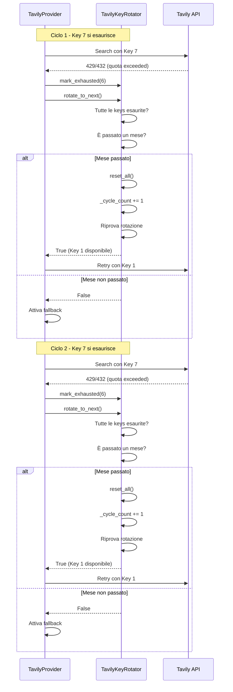

# Piano: Doppio Ciclo di Rotazione API Tavily

## Obiettivo
Implementare una logica di "doppio ciclo" prima di attivare il fallback a Brave/DDG. Quando l'ultima API key si consuma, il sistema deve:
1. Verificare se è passato un mese (la prima key dovrebbe essersi ricaricata)
2. Se sì, ripartire dal ciclo dall'inizio
3. Se anche il secondo ciclo è finito, allora attivare il fallback

## Analisi Attuale

### Logica Corrente (TavilyKeyRotator)
- **7 API keys** con limite 1000 chiamate/mese ciascuna
- Rotazione **round-robin sequenziale**
- Quando una key riceve errore 429/432, viene marcata come esaurita
- Quando tutte le keys sono esaurite, `rotate_to_next()` restituisce `False`
- `get_current_key()` restituisce `None` quando tutte le keys sono esaurite
- TavilyProvider attiva il fallback quando riceve `None`

### Problema
Quando tutte le keys sono esaurite, il sistema attiva immediatamente il fallback senza verificare se è passato un mese e le keys si sono ricaricate.

## Soluzione Progettata

### Nuova Logica di Doppio Ciclo

```
┌─────────────────────────────────────────────────────────────┐
│                    FLUSSO DI ROTAZIONE                        │
├─────────────────────────────────────────────────────────────┤
│                                                              │
│  Ciclo 1: Key 1 → Key 2 → ... → Key 7                      │
│                                                              │
│  Quando Key 7 si esaurisce:                                  │
│  ├─ Verifica se è passato un mese?                          │
│  │  ├─ SÌ → Reset keys, riparti da Key 1 (Ciclo 2)          │
│  │  └─ NO → Attiva fallback a Brave/DDG                     │
│                                                              │
│  Ciclo 2: Key 1 → Key 2 → ... → Key 7                      │
│                                                              │
│  Quando Key 7 si esaurisce di nuovo:                        │
│  └─ Attiva fallback a Brave/DDG                             │
│                                                              │
└─────────────────────────────────────────────────────────────┘
```

### Modifiche a TavilyKeyRotator

#### 1. Nuovi Attributi
```python
self._cycle_count: int = 0           # Numero di cicli completati
self._last_cycle_month: Optional[int] = None  # Mese dell'ultimo ciclo
```

#### 2. Modifica a `rotate_to_next()`
**Comportamento attuale:**
- Cerca la prossima key non esaurita
- Se tutte esaurite, restituisce `False`

**Nuovo comportamento:**
- Cerca la prossima key non esaurita
- Se tutte esaurite:
  - Verifica se è passato un mese dall'ultimo reset
  - Se sì:
    - Chiama `reset_all()`
    - Incrementa `_cycle_count`
    - Aggiorna `_last_cycle_month`
    - Riprova la rotazione (ora Key 1 è disponibile)
    - Restituisce `True` se successo, `False` se ancora tutte esaurite
  - Se no:
    - Restituisce `False`

#### 3. Modifica a `reset_all()`
- Mantieni il reset esistente
- Aggiorna `_last_cycle_month` se chiamato da `rotate_to_next()`

#### 4. Nuovo metodo `get_cycle_count()`
```python
def get_cycle_count(self) -> int:
    """Get the number of completed cycles."""
    return self._cycle_count
```

#### 5. Aggiornamento a `get_status()`
Aggiungere campi:
```python
{
    ...
    "cycle_count": self._cycle_count,
    "current_cycle": self._cycle_count + 1,
    "last_cycle_month": self._last_cycle_month,
}
```

### Modifiche a TavilyProvider

Nessuna modifica necessaria alla logica esistente. Quando `rotate_to_next()` restituisce `True` dopo il reset, il retry automatico funzionerà come previsto.

### Diagramma di Sequenza



## Dettagli di Implementazione

### File da Modificare
1. `src/ingestion/tavily_key_rotator.py` - Logica principale di rotazione
2. `tests/test_tavily_key_rotator.py` - Test esistenti da aggiornare

### Nuovi Test da Aggiungere
1. `test_double_cycle_with_monthly_reset()` - Verifica il doppio ciclo con reset mensile
2. `test_double_cycle_no_monthly_reset()` - Verifica il fallback quando il mese non è passato
3. `test_cycle_count_tracking()` - Verifica il tracciamento dei cicli
4. `test_status_includes_cycle_info()` - Verifica le informazioni sui cicli in get_status()

### Log dei Messaggi
Nuovi messaggi di log:
- `🔄 Tavily double cycle: Starting cycle {cycle_count + 1} after monthly reset`
- `⚠️ Tavily: Month not passed, activating fallback after cycle {cycle_count}`

## Vantaggi della Soluzione

1. **Massimizza l'utilizzo delle API Tavily**: Utilizza fino a 14000 chiamate/mese invece di attivare il fallback dopo 7000
2. **Gestione automatica del reset mensile**: Non richiede intervento manuale
3. **Backward compatible**: Non rompe la logica esistente
4. **Monitoraggio migliorato**: Tracciamento dei cicli completati

## Scenari di Esempio

### Scenario 1: Reset Mensile Disponibile
```
Giorno 1-28: Ciclo 1 - Keys 1-7 esaurite (7000 chiamate)
Giorno 29: Key 7 si esaurisce
  → È passato un mese? SÌ
  → Reset keys, riparti da Key 1 (Ciclo 2)
Giorno 29-30: Ciclo 2 - Keys 1-2 utilizzate (2000 chiamate)
```

### Scenario 2: Reset Mensile Non Disponibile
```
Giorno 1: Tutte le keys esaurite rapidamente (es. bug o test)
  → È passato un mese? NO
  → Attiva fallback a Brave/DDG
```

### Scenario 3: Doppio Ciclo Completo
```
Mese 1: Ciclo 1 - Keys 1-7 esaurite (7000 chiamate)
Mese 2: Ciclo 2 - Keys 1-7 esaurite (7000 chiamate)
  → Quando Key 7 si esaurisce nel ciclo 2
  → È passato un mese? NO (solo 1 giorno fa)
  → Attiva fallback a Brave/DDG
```

## Note Importanti

1. **Reset mensile automatico**: Il sistema usa `datetime.now(timezone.utc).month` per rilevare il cambio di mese
2. **Tracciamento dei cicli**: `_cycle_count` incrementa solo quando avviene un reset dopo che tutte le keys sono esaurite
3. **Fallback invariato**: La logica di fallback a Brave/DDG rimane identica
4. **Thread safety**: Il sistema è già thread-safe tramite il pattern Singleton

## Checklist di Implementazione

- [ ] Aggiungere `_cycle_count` e `_last_cycle_month` a `__init__`
- [ ] Modificare `rotate_to_next()` per tentare il reset mensile
- [ ] Aggiungere metodo `get_cycle_count()`
- [ ] Aggiornare `get_status()` per includere informazioni sui cicli
- [ ] Aggiornare docstrings e commenti
- [ ] Creare test per il doppio ciclo
- [ ] Aggiornare test esistenti se necessario
- [ ] Verificare l'integrazione con TavilyProvider
- [ ] Testare il fallback dopo il doppio ciclo
