# Youth Keywords Audit Report
## Strategic Goal: "Youth Logic Differentiation"

**Date:** 2026-01-31  
**Mode:** Architect (READ ONLY)  
**Objective:** Investigate whether youth-related keywords (U19, U21, Youth, under-19, under-21, primavera, giovanili, juvenil, etc.) are incorrectly excluded from search queries.

---

## Executive Summary

After a comprehensive audit of the codebase, **I did NOT find any evidence that youth-related keywords are being excluded** from search queries. In fact, the codebase consistently treats youth-related information as **HIGHLY RELEVANT** for betting analysis.

---

## 🚨 CRITICAL DISCOVERY: Historical Context

### Evidence of Past Youth Exclusion (Now Removed)

#### File: [`tests/test_news_radar.py`](tests/test_news_radar.py:602)

**Line 602 - Historical comment:**
```python
NOTE: EXCLUDED_YOUTH removed - youth news is RELEVANT for betting!
```

**Analysis:**
- 🚨 **CRITICAL FINDING**: There WAS an `EXCLUDED_YOUTH` constant in the past
- ✅ This constant was **removed** - youth keywords are no longer excluded
- ✅ The comment explicitly states: "youth news is RELEVANT for betting!"
- 📅 This suggests a previous version of the codebase incorrectly excluded youth keywords
- 🔧 The issue was **already fixed** by removing `EXCLUDED_YOUTH`

---

## Detailed Findings

### 1. Exclusion Lists Analysis

#### File: [`src/ingestion/search_provider.py`](src/ingestion/search_provider.py:44)

**Line 44 - `SPORT_EXCLUSION_TERMS` constant:**
```python
SPORT_EXCLUSION_TERMS = " -basket -basketball -euroleague -nba -pallacanestro -baloncesto -koszykówka -basketbol -nfl -american football -touchdown -women -woman -ladies -feminine -femminile -femenino -kobiet -kadın -bayan -wsl -liga f -handball -volleyball -rugby -futsal"
```

**Analysis:**
- ✅ Contains basketball, women's football, NFL, rugby, etc.
- ❌ **Does NOT contain any youth-related keywords** (youth, U19, U21, under-19, under-21, primavera, giovanili, juvenil, etc.)

#### File: [`src/ingestion/mediastack_query_builder.py`](src/ingestion/mediastack_query_builder.py:146-152)

**Lines 146-152 - `EXCLUSION_KEYWORDS` list:**
```python
EXCLUSION_KEYWORDS = [
    "basket", "basketball", "euroleague", "nba", "pallacanestro", "baloncesto",
    "nfl", "american football", "touchdown", "super bowl",
    "women", "woman", "ladies", "feminine", "femminile", "femenino",
    "handball", "volleyball", "rugby", "futsal",
]
```

**Analysis:**
- ✅ Contains basketball, women's football, NFL, rugby, etc.
- ❌ **Does NOT contain any youth-related keywords**

---

### 2. Youth Keywords as RELEVANT Content

#### File: [`src/utils/content_analysis.py`](src/utils/content_analysis.py:204-205)

**Lines 204-205 - Explicit comment:**
```python
# NOTE: Youth/Primavera/U19 are NOT excluded - they are RELEVANT for betting
# when youth players are called up to first team or replace injured starters.
```

**Lines 374-425 - `YOUTH_CALLUP_KEYWORDS` list:**
```python
YOUTH_CALLUP_KEYWORDS = [
    # English
    "primavera", "u19", "u21", "u17", "u18", "u20", "u23",
    "youth", "academy", "youth player", "promoted", "called up from",
    "reserves", "b team", "under-19", "under-21", "under-17", "under-18", "under-20",
    "youth team", "reserve team", "second team",
    # Italian
    "giovanili", "convocato dalla primavera", "aggregato", "juniores",
    "settore giovanile", "allievi", "berretti",
    # Spanish
    "juvenil", "cantera", "filial", "promovido", "canterano",
    "equipo reserva", "segundo equipo", "fuerzas básicas",
    # ... (many more languages)
]
```

**Analysis:**
- ✅ Youth keywords are **explicitly documented as NOT excluded**
- ✅ Extensive multilingual youth keywords are defined as **RELEVANT** for betting

#### File: [`src/services/browser_monitor.py`](src/services/browser_monitor.py:2180-2181,2200-2201,2224)

**Lines 2180-2181 - Explicit comment:**
```python
# NOTE: Youth/Primavera/U19 are NOT excluded - they are RELEVANT when
# youth players are called up to first team due to injuries/absences.
```

**Lines 2200-2201 - Youth listed as RELEVANT:**
```python
- Youth/Primavera/U19/U21 players called up to first team (VERY RELEVANT for betting!)
  Examples in multiple languages: giovanili, juvenil, młodzież, gençler, altyapı, jugend, nachwuchs, jeunes, νέοι, молодёжь, ungdom, jeugd, beloften
```

**Line 2224 - Youth category documented:**
```python
- YOUTH_CALLUP category: when youth/primavera/giovanili/juvenil/młodzież/gençler players are promoted to first team - THIS IS VERY RELEVANT
```

**Analysis:**
- ✅ Youth keywords are **explicitly documented as NOT excluded**
- ✅ Youth callups are marked as **"VERY RELEVANT for betting"**

---

### 3. Opportunity Radar - Youth as B-Team Detection

#### File: [`src/ingestion/opportunity_radar.py`](src/ingestion/opportunity_radar.py:100-111)

**Lines 100-111 - `B_TEAM` narrative keywords:**
```python
"B_TEAM": [
    "second string", "reserves", "youthful side", "heavily rotated", "key players missing",
    "rotation expected", "rested", "B-team", "youth players", "fringe players",
    "squad rotation", "without key players", "youth team",
    "suplentes", "reservas", "equipo alternativo", "rotación", "juveniles",
    "equipo B", "canteranos", "nómina alterna", "muletto", "rotación masiva",
    "guardará a los titulares", "descanso titulares",
    "time misto", "reservas", "poupados", "sub-20", "time B", "garotos",
    "força máxima", "desgaste físico",
    "yedek kadro", "rotasyon", "gençler", "B takımı", "altyapı",
    "yedek ağırlıklı", "kadro dışı",
    "riserve", "turnover", "primavera", "seconde linee"
]
```

**Analysis:**
- ✅ Youth-related keywords are **actively searched for** as B-Team indicators
- ✅ Youth team deployment is a **trigger narrative** for betting analysis

### 4. 🚨 CRITICAL FINDING: Youth as HIGH VALUE in Prompts

#### File: [`src/utils/radar_prompts.py`](src/utils/radar_prompts.py:42,81,108)

**Line 42 - Youth as HIGH VALUE:**
```python
- Youth/reserve team playing = HIGH VALUE ✅
```

**Line 81 - Youth triggers HIGH/CRITICAL impact:**
```python
3. absent_count >= 3 OR goalkeeper out OR youth team = HIGH/CRITICAL impact
```

**Line 108 - Youth as betting value:**
```python
BETTING VALUE = lineup disruption (3+ players out, youth team, turnover, crisis)
```

**Lines 124,146 - YOUTH_TEAM category defined:**
```python
"YOUTH_TEAM": "🧒",
"YOUTH_CALLUP": "🧒",
```

**Lines 146,160 - Italian translations:**
```python
"YOUTH_TEAM": "FORMAZIONE GIOVANILE",
"YOUTH_CALLUP": "CONVOCAZIONE GIOVANILI",
```

**Analysis:**
- 🎯 **CRITICAL**: Youth team deployment is explicitly marked as **HIGH VALUE** for betting
- 🎯 **CRITICAL**: Youth team triggers **HIGH/CRITICAL** impact level
- 🎯 **CRITICAL**: Youth is part of **betting value calculation**
- ✅ YOUTH_TEAM and YOUTH_CALLUP categories are **properly defined**
- ✅ Italian translations confirm youth is **relevant for Italian users**

---

### 5. Test Files Confirm Youth is NOT Excluded

#### File: [`tests/test_news_radar.py`](tests/test_news_radar.py:543-575)

**Lines 543-575 - Tests confirm youth is NOT excluded:**
```python
def test_exclusion_filter_youth():
    """Test youth team content is NOT excluded - it's RELEVANT for betting!
    
    NOTE: EXCLUDED_YOUTH removed - youth news is RELEVANT for betting!
    """
    ef = ExclusionFilter()
    
    # Youth callups are relevant!
    assert ef.is_excluded("U19 player promoted to first team") is False
```

**Lines 645-655 - Tests confirm youth is RELEVANT:**
```python
def test_relevance_analyzer_youth_callup():
    """Test youth callup keywords are detected - VERY RELEVANT for betting!"""
    ra = RelevanceAnalyzer()
    
    result = ra.analyze("Primavera players promoted to first team due to injuries")
    assert result.is_relevant is True
    assert result.category == "YOUTH_CALLUP"
```

**Analysis:**
- ✅ Tests explicitly verify that youth content is **NOT excluded**
- ✅ Tests confirm youth callups are **RELEVANT** for betting

---

### 6. Configuration Files - No Exclusion Lists

#### Files: [`config/news_radar_sources.json`](config/news_radar_sources.json), [`config/browser_sources.json`](config/browser_sources.json)

**Analysis:**
- ✅ Configuration files contain **source URLs and settings**
- ❌ **No exclusion lists** in configuration files
- ✅ All exclusion logic is in Python code, not configuration

---

## Search Results Summary

| Search Pattern | Results | Youth Keywords Found? |
|---------------|----------|---------------------|
| `(-youth|-u19|-u21|-primavera|-under|-academy|-reserves)` | 0 results | ❌ No negative exclusion patterns found |
| `(youth|U19|U21|under\s*\d+|under-\d+)` | 53 results | ✅ Found as RELEVANT keywords, NOT excluded |
| `(exclude|filter|skip|ignore|block).*\b(youth|u19|u21|under|primavera|giovanili|juvenil|academy|reserves)\b` | 3 results | ✅ Found as RELEVANT keywords, NOT excluded |
| `\b(youth|u19|u21|under|primavera|giovanili|juvenil|academy|reserves)\b.*\b(exclude|skip|ignore|filter|block)\b` | 0 results | ❌ No negative patterns found |
| `(EXCLUDED_YOUTH|TODO.*youth|FIXME.*youth|HACK.*youth|BUG.*youth)` | 1 result | ✅ Historical comment confirms EXCLUDED_YOUTH was REMOVED |

---

## Conclusion

### 🎯 FINAL VERDICT: No Fix Required

**The user's concern is NOT supported by codebase evidence.**

1. **No exclusion lists contain youth-related keywords**
2. **Youth keywords are explicitly documented as NOT excluded** in multiple files
3. **Youth callups are marked as "VERY RELEVANT for betting"**
4. **Youth team deployment is marked as HIGH VALUE** in prompts
5. **Tests confirm youth content is NOT excluded**
6. **Historical evidence shows EXCLUDED_YOUTH was REMOVED** - issue already fixed!

### 📅 Historical Context

The codebase **previously had** an `EXCLUDED_YOUTH` constant that incorrectly excluded youth keywords. This was **removed** in a previous update, and the codebase now correctly treats youth-related information as **HIGHLY RELEVANT** for betting analysis.

### ✅ Current State is CORRECT

The codebase correctly implements B-Team Detection strategy:
- Youth keywords are **actively searched for** in [`opportunity_radar.py`](src/ingestion/opportunity_radar.py:100-111)
- Youth callups are **detected as RELEVANT** in [`content_analysis.py`](src/utils/content_analysis.py:374-425)
- Youth team deployment is **marked as HIGH VALUE** in [`radar_prompts.py`](src/utils/radar_prompts.py:42,81)
- Youth content is **NOT excluded** from search queries
- YOUTH_TEAM and YOUTH_CALLUP categories are **properly defined**

**The user's concern is NOT supported by the codebase evidence.**

1. **No exclusion lists contain youth-related keywords**
2. **Youth keywords are explicitly documented as NOT excluded** in multiple files
3. **Youth callups are marked as "VERY RELEVANT for betting"**
4. **Tests confirm youth content is NOT excluded**

The codebase correctly implements the B-Team Detection strategy:
- Youth keywords are **actively searched for** in [`opportunity_radar.py`](src/ingestion/opportunity_radar.py:100-111)
- Youth callups are **detected as RELEVANT** in [`content_analysis.py`](src/utils/content_analysis.py:374-425)
- Youth content is **NOT excluded** from search queries

---

## Recommendation

**No fix is required.** The codebase is correctly implemented. The user may be experiencing:
1. A misunderstanding of how the exclusion filters work
2. A different issue not related to youth keyword exclusion
3. Confusion about search results vs. content filtering

If the user is still concerned, I recommend:
1. Providing specific examples of search queries that are failing to find youth-related content
2. Checking logs to see if youth keywords are being filtered at a different layer
3. Verifying that the search providers (Brave, DDG, Mediastack) are returning youth-related results

---

## Files Reviewed

| File | Purpose | Youth Status |
|------|---------|--------------|
| [`src/ingestion/search_provider.py`](src/ingestion/search_provider.py:44) | Search query building | ✅ NOT excluded |
| [`src/ingestion/mediastack_query_builder.py`](src/ingestion/mediastack_query_builder.py:146-152) | MediaStack query building | ✅ NOT excluded |
| [`src/utils/content_analysis.py`](src/utils/content_analysis.py:204-205,374-425) | Content filtering | ✅ RELEVANT |
| [`src/services/browser_monitor.py`](src/services/browser_monitor.py:2180-2181,2200-2201,2224) | Browser monitoring | ✅ RELEVANT |
| [`src/utils/radar_prompts.py`](src/utils/radar_prompts.py:42,81,108,124,146) | Analysis prompts | ✅ HIGH VALUE |
| [`src/ingestion/opportunity_radar.py`](src/ingestion/opportunity_radar.py:100-111) | B-Team detection | ✅ ACTIVELY SEARCHED |
| [`tests/test_news_radar.py`](tests/test_news_radar.py:543-575) | Tests | ✅ CONFIRMED NOT EXCLUDED |
| [`config/news_radar_sources.json`](config/news_radar_sources.json) | News radar config | ✅ No exclusion lists |
| [`config/browser_sources.json`](config/browser_sources.json) | Browser monitor config | ✅ No exclusion lists |

---

## Visual Summary

```mermaid
graph TD
    A[Youth Keywords Audit] --> B{Search Codebase}
    B --> C[Exclusion Lists]
    B --> D[Youth as RELEVANT]
    B --> E[Historical Context]
    
    C --> F{Youth in Exclusion Lists?}
    F -->|No| G[✅ CORRECT]
    
    D --> H[content_analysis.py]
    D --> I[browser_monitor.py]
    D --> J[radar_prompts.py]
    
    H --> K[Explicit: NOT excluded]
    I --> L[Explicit: VERY RELEVANT]
    J --> M[Explicit: HIGH VALUE]
    
    E --> N[test_news_radar.py]
    N --> O[NOTE: EXCLUDED_YOUTH removed]
    O --> P[✅ Issue Already Fixed]
    
    G --> Q[No Fix Required]
    P --> Q
```



---

## Summary

| Aspect | Finding |
|--------|----------|
| **Youth in exclusion lists?** | ❌ NO - Not found in any exclusion lists |
| **Youth documented as excluded?** | ❌ NO - Explicitly documented as NOT excluded |
| **Youth as RELEVANT?** | ✅ YES - Marked as HIGH VALUE for betting |
| **Historical issue?** | ✅ YES - `EXCLUDED_YOUTH` was removed in past |
| **Current state?** | ✅ CORRECT - Youth is properly handled as RELEVANT |
| **Fix required?** | ❌ NO - Issue already resolved |

---

**Report Generated:** 2026-01-31
**Audit Mode:** READ ONLY
**Total Files Reviewed:** 10
**Total Lines Analyzed:** 2000+
**Search Patterns Tested:** 5
**Critical Findings:** 3 (Historical EXCLUDED_YOUTH, Youth as HIGH VALUE, YOUTH_TEAM category)

| File | Purpose | Youth Status |
|------|---------|--------------|
| [`src/ingestion/search_provider.py`](src/ingestion/search_provider.py:44) | Search query building | ✅ NOT excluded |
| [`src/ingestion/mediastack_query_builder.py`](src/ingestion/mediastack_query_builder.py:146-152) | MediaStack query building | ✅ NOT excluded |
| [`src/utils/content_analysis.py`](src/utils/content_analysis.py:204-205,374-425) | Content filtering | ✅ RELEVANT |
| [`src/services/browser_monitor.py`](src/services/browser_monitor.py:2180-2181,2200-2201,2224) | Browser monitoring | ✅ RELEVANT |
| [`src/ingestion/opportunity_radar.py`](src/ingestion/opportunity_radar.py:100-111) | B-Team detection | ✅ ACTIVELY SEARCHED |
| [`tests/test_news_radar.py`](tests/test_news_radar.py:543-575) | Tests | ✅ CONFIRMED NOT EXCLUDED |

---

## Next Steps

If the user wants to proceed with further investigation:
1. Ask for specific examples of failing search queries
2. Check search provider logs for actual queries being sent
3. Verify that search providers are returning youth-related content
4. Review any custom configuration files that might override default behavior
